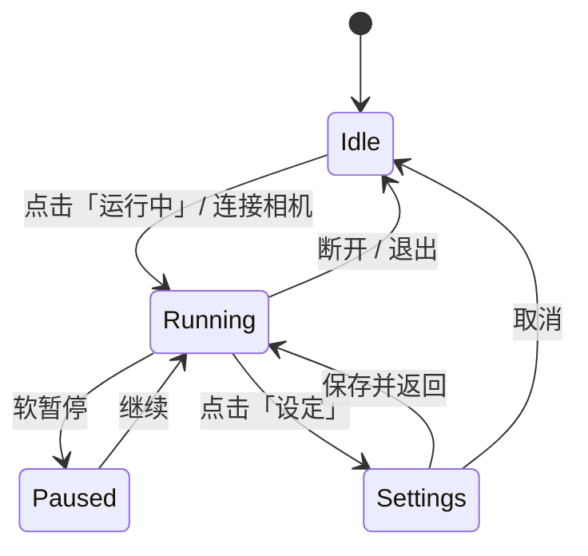

# MarkEye Web UI 设计稿

> **版本**: v1.0  
> **日期**: 2025-06-26  
> **参考界面**: `ui/IV3/main_win.bmp`（Keyence IV3 系列主窗口）  
> **显示框架**: Web 端（浏览器 / WebView 嵌入）  
> **前端模版**: 原生 HTML + JS + CSS（无框架依赖）

---

## 1. 设计目标

将 Keyence IV3 工业视觉软件的主窗口布局迁移为 MarkEye 的 Web 操作界面，保留产线操作员熟悉的视觉习惯，同时对接 MarkEye 后端检测能力（颜色 / 大小 / 位置判定）。

| 目标 | 说明 |
|------|------|
| 产线可读性 | 大字号 OK/NG、高对比色块，3 米外可辨识 |
| 实时性 | 相机帧 ≥ 15 fps 刷新，处理耗时实时显示 |
| 配置驱动 | 检测阈值来自 `config/config.yaml`，UI 只展示与调节 |
| 可维护 | 模版与资源分离，`template/` 放页面逻辑，`icon/` 放图标 |

---

## 2. 参考布局分析

参考图分辨率：**1920 × 991 px**，纵横比约 **16:9**（产线触摸屏常用分辨率）。

```
┌──────────────────────────────────────────────────────────────────────────────┐
│ 菜单栏  文件 | 显示 | 传感器 | 图像 | 设定 | 窗口 | 帮助                        │  h≈24
├──────────────────────────────────────────────────────────────────────────────┤
│ [▶ 运行中]  [⚙ 设定]          程序: P005: xxx          [详细 ▼]              │  h≈52
├──────────────────────────────────────────────────────────────────────────────┤
│ ┌────┐  已学习: 3张  外部触发  处理: 439ms        [追加学习] [调节阈值]       │  h≈58
│ │ OK │                                                                       │
│ └────┘                                                                       │
├────────────────────────────────────────────┬─────────────────────────────────┤
│ 图像工具栏 [🔍+][🔍-] 69% [适应][处理▼][T] │  Tool 01  学习计数  ████░░  OK   │
│ ┌──────────────────────────────────────┐  │  Tool 02  学习计数  ████░░  OK   │  主区
│ │                                      │  │  Tool 03  面积检测  ████░░  OK   │  h≈670
│ │         实时图像 / 检测结果叠加        │  │  ─────────────────────────────  │
│ │         (绿框标注 + 标签)              │  │  选中 Tool 详情面板              │
│ │                                      │  │  [直方图]  当前值: 40            │
│ └──────────────────────────────────────┘  │  OK:18 NG:4 Max:42 Min:36        │
├────────────────────────────────────────────┤                                 │
│ 处理时间 439ms  Max 441  Min 437  Ave 440 │                                 │
├────────────────────────────────────────────┴─────────────────────────────────┤
│ [切换] [复位↺]                    [菜单] [切换/断开]    [统计] [切换画面]      │  h≈48
└──────────────────────────────────────────────────────────────────────────────┘
```

### 2.1 IV3 → MarkEye 功能映射

| IV3 区域 | IV3 含义 | MarkEye 对应 |
|----------|----------|--------------|
| 运行中 / 设定 | 模式切换 | **运行模式** / **设定模式** |
| 程序选择下拉 | 检测程序 | **配置方案**（`config.yaml` / `config.local.yaml`） |
| 大 OK 方块 | 总判定 | **综合 Pass/Fail**（`InspectionResult.passed` 汇总） |
| 已学习 N 张 | 学习样本数 | **标定样本数**（合格品建档计数） |
| 外部触发 | 触发方式 | **触发源**：外部 IO / 软触发 / 连续采集 |
| 处理 N ms | 单帧耗时 | **Pipeline 耗时**（预处理+检测+检查） |
| 追加学习 | 追加训练 | **追加标定**（记录当前合格帧为参考） |
| 调节阈值 | 阈值调节 | **打开阈值面板**（颜色 HSV / 面积 / 位置公差） |
| Tool 01~03 | 检测工具 | **检查项**：颜色 / 大小 / 位置（对应 `inspect.*`） |
| 图像区绿框 | 检测叠加 | **轮廓 + 标签**（`draw_detection` 输出转 Canvas/SVG） |
| 直方图 + 统计 | 工具详情 | **单项指标分布**（面积偏差、色差、偏移量） |
| 底部统计表 | 耗时统计 | **帧处理时间** Max/Min/Ave |
| 复位 | 计数复位 | **统计复位**（OK/NG 计数清零） |

---

## 3. 技术架构

```
┌─────────────┐     WebSocket / REST      ┌─────────────────────┐
│  浏览器 UI   │ ◄──────────────────────► │  Python 后端服务     │
│ template/   │   JSON + Base64 图像帧    │  src/main.py 扩展    │
│ icon/       │                           │  OpenCV 检测管线      │
└─────────────┘                           └─────────────────────┘
```

| 层级 | 技术选型 | 说明 |
|------|----------|------|
| 表现层 | HTML5 + CSS3 + ES6+ | 模版放 `template/`，无 React/Vue 依赖 |
| 图像渲染 | `<canvas>` + SVG 叠加层 | 底图 JPEG/Base64，标注用 SVG 矢量 |
| 图表 | Chart.js（可选 CDN） | Tool 详情区直方图 / 趋势图 |
| 通信 | WebSocket（实时帧）+ REST（配置/控制） | 后续 `src/web_server.py` 实现 |
| 嵌入 | Chromium WebView / 全屏浏览器 | Ubuntu 产线 kiosk 模式 |

---

## 4. 目录结构

```
markeye/
├── template/                    # Web UI 模版（JS + CSS）
│   ├── index.html               # 主窗口入口
│   ├── css/
│   │   ├── variables.css        # 设计令牌（颜色、字号、间距）
│   │   ├── layout.css           # 栅格与区域布局
│   │   ├── components.css       # 按钮、卡片、工具条、状态块
│   │   └── theme-industrial.css # 工业灰主题（默认）
│   └── js/
│       ├── app.js               # 入口：初始化、事件绑定
│       ├── layout.js            # 区域尺寸、全屏适配
│       ├── image-viewer.js      # 图像缩放、适应、叠加绘制
│       ├── tool-panel.js        # 右侧 Tool 列表与详情
│       ├── status-bar.js        # 顶部/底部状态栏刷新
│       ├── api-client.js        # WebSocket / REST 封装
│       └── config-editor.js     # 设定模式：阈值编辑（可选）
├── icon/                        # 图标与静态资源
│   ├── logo/
│   │   └── markeye-32.png       # 应用图标
│   ├── mode/
│   │   ├── run-active.svg       # 运行中（橙色底）
│   │   ├── run-inactive.svg
│   │   ├── settings-active.svg  # 设定（灰色底）
│   │   └── settings-inactive.svg
│   ├── toolbar/
│   │   ├── zoom-in.svg
│   │   ├── zoom-out.svg
│   │   ├── fit-screen.svg
│   │   ├── process.svg
│   │   └── text-tool.svg
│   ├── status/
│   │   ├── ok-badge.svg
│   │   ├── ng-badge.svg
│   │   └── trigger-external.svg
│   ├── action/
│   │   ├── learn-add.svg        # 追加学习
│   │   ├── threshold.svg        # 调节阈值
│   │   ├── reset.svg            # 复位
│   │   └── switch.svg           # 切换
│   └── nav/
│       ├── menu.svg
│       ├── disconnect.svg
│       ├── statistics.svg
│       └── switch-screen.svg
├── ui/
│   └── IV3/
│       └── main_win.bmp         # 布局参考原图
└── plan/
    └── UI设计稿.md              # 本文档
```

---

## 5. 设计令牌（Design Tokens）

定义于 `template/css/variables.css`。

### 5.1 色彩

| 令牌 | 色值 | 用途 |
|------|------|------|
| `--color-bg-app` | `#C8C8C8` | 应用背景（浅灰） |
| `--color-bg-panel` | `#E8E8E8` | 面板背景 |
| `--color-bg-dark` | `#4A4A4A` | 状态摘要栏背景 |
| `--color-bg-image` | `#2A2A2A` | 图像视口背景 |
| `--color-ok` | `#00B050` | OK 判定、合格 Tool |
| `--color-ng` | `#E74C3C` | NG 判定、不合格 Tool |
| `--color-run-active` | `#FF9900` | 「运行中」激活 Tab |
| `--color-settings` | `#9E9E9E` | 「设定」Tab |
| `--color-btn-primary` | `#70B5E8` | 主操作按钮（追加学习） |
| `--color-btn-secondary` | `#BDBDBD` | 次操作按钮 |
| `--color-text-on-dark` | `#FFFFFF` | 深色背景文字 |
| `--color-text-primary` | `#212121` | 主文字 |
| `--color-text-secondary` | `#616161` | 辅助文字 |
| `--color-tool-selected` | `#FFF3E0` | 选中 Tool 卡片背景 |
| `--color-overlay-green` | `rgba(0,176,80,0.85)` | 检测框描边 |

### 5.2 字号

| 令牌 | 大小 | 用途 |
|------|------|------|
| `--font-family` | `"Segoe UI", "Microsoft YaHei", sans-serif` | 全局字体 |
| `--font-size-menu` | `13px` | 顶部菜单栏 |
| `--font-size-body` | `14px` | 正文、Tool 标签 |
| `--font-size-status` | `16px` | 状态摘要文字 |
| `--font-size-ok-ng` | `48px` | 大 OK/NG 方块 |
| `--font-size-metric` | `28px` | Tool 详情当前值 |

### 5.3 间距与圆角

| 令牌 | 值 | 用途 |
|------|-----|------|
| `--radius-sm` | `2px` | 按钮、输入框 |
| `--radius-md` | `4px` | 卡片、图像区 |
| `--spacing-xs` | `4px` | 紧凑间距 |
| `--spacing-sm` | `8px` | 组件内边距 |
| `--spacing-md` | `16px` | 区域间距 |
| `--header-height` | `134px` | 菜单+模式+状态栏总高 |
| `--footer-height` | `96px` | 底栏+导航总高 |
| `--sidebar-width` | `28%` | 右侧 Tool 面板（min 320px, max 480px） |

---

## 6. 主窗口布局规格

基准画布：**1920 × 991 px**（`min-width: 1280px` 时启用横向滚动或等比缩放）。

### 6.1 区域划分（CSS Grid）

```css
/* template/css/layout.css 核心结构 */
.app-root {
  display: grid;
  grid-template-rows: var(--header-height) 1fr var(--footer-height);
  grid-template-columns: 1fr;
  height: 100vh;
  overflow: hidden;
}

.main-body {
  display: grid;
  grid-template-columns: 1fr var(--sidebar-width);
  min-height: 0;
}
```

| 区域 ID | Grid 位置 | 尺寸参考 | 内容 |
|---------|-----------|----------|------|
| `#region-menu` | row 1 | 全宽 × 24px | 菜单栏 |
| `#region-mode` | row 1 | 全宽 × 52px | 运行/设定 Tab + 程序选择 |
| `#region-summary` | row 1 | 全宽 × 58px | OK 块 + 状态文字 + 操作按钮 |
| `#region-image` | row 2, col 1 | ~72% 宽 | 图像视口 + 工具栏 |
| `#region-tools` | row 2, col 2 | ~28% 宽 | Tool 列表 + 详情 |
| `#region-stats` | row 3 | 左下 | 处理时间统计表 |
| `#region-nav` | row 3 | 全宽底栏 | 导航按钮组 |

### 6.2 顶部菜单栏 `#region-menu`

| 菜单项 | 快捷键 | MarkEye 功能 |
|--------|--------|--------------|
| 文件(F) | Alt+F | 打开图片、导出结果、退出 |
| 显示(V) | Alt+V | 显示/隐藏叠加层、调试图层 |
| 传感器(S) | Alt+S | 相机选择、曝光/增益 |
| 图像(I) | Alt+I | 截图、保存当前帧 |
| 设定(S) | Alt+S | 切换设定模式、编辑 config |
| 窗口(W) | Alt+W | 全屏、置顶 |
| 帮助(H) | Alt+H | 版本信息、操作说明 |

样式：背景 `#D1D1D1`，高度 24px，项间分隔线，hover 高亮 `#B0B0B0`。

### 6.3 模式切换栏 `#region-mode`

```
┌──────────────────┬──────────────────┐     ┌─────────────────────────┐  ┌────────┐
│  ▶  运行中        │  ⚙  设定          │     │ P005: 开发室 1C649-360 ▼│  │ 详细   │
│  (橙色激活)       │  (灰色)           │     │ 配置方案下拉             │  │        │
└──────────────────┴──────────────────┘     └─────────────────────────┘  └────────┘
```

- 左：两个 Tab 按钮，宽各 160px，高 48px，图标来自 `icon/mode/`。
- 中：`<select id="config-profile">` 列出 `config/*.yaml`。
- 右：「详细」按钮展开程序元信息（最后修改时间、检测项开关）。

**交互**：点击「设定」→ 主区切换为参数编辑表单；「运行中」→ 恢复实时监控。

### 6.4 状态摘要栏 `#region-summary`

| 组件 | ID | 规格 | 数据绑定 |
|------|-----|------|----------|
| 总判定块 | `#verdict-badge` | 80×80px 方块，字号 48px | `overall.passed` → 背景 OK绿/NG红 |
| 学习计数 | `#learn-count` | 正文 16px | `calibration.sample_count` |
| 触发方式 | `#trigger-mode` | 正文 16px | `trigger.source` |
| 处理耗时 | `#process-time` | 正文 16px | `frame.process_ms` |
| 追加学习 | `#btn-learn-add` | 主色按钮 120×36 | POST `/api/calibration/add` |
| 调节阈值 | `#btn-threshold` | 次色按钮 120×36 | 打开阈值侧滑面板 |

背景：`--color-bg-dark`，内边距 12px。

### 6.5 图像显示区 `#region-image`

#### 工具栏 `#image-toolbar`（高 36px）

| 按钮 | 图标 | 功能 |
|------|------|------|
| 放大 | `icon/toolbar/zoom-in.svg` | 缩放 +10% |
| 缩小 | `icon/toolbar/zoom-out.svg` | 缩放 -10% |
| 缩放比 | `#zoom-label` | 显示如 `69%` |
| 适应屏幕 | `icon/toolbar/fit-screen.svg` | `scale = min(cw/iw, ch/ih)` |
| 处理 | `icon/toolbar/process.svg` | 下拉：原图 / 二值化 / 叠加 |
| 文字工具 | `icon/toolbar/text-tool.svg` | 切换标注文字显示 |

#### 视口 `#image-viewport`

结构：

```html
<div id="image-viewport" class="image-viewport">
  <canvas id="frame-canvas"></canvas>
  <svg id="overlay-svg" class="overlay-layer"></svg>
  <div id="tool-label" class="floating-label">Tool03: 40</div>
</div>
```

| 属性 | 值 |
|------|-----|
| 背景 | `#2A2A2A` |
| 最小高度 | 500px |
| 叠加层 | SVG `<rect>` 检测框 + `<text>` 标签 |
| 合格框色 | `#00B050`，线宽 2px |
| 不合格框色 | `#E74C3C`，线宽 2px |

**数据**：`frame.image_base64` 绘制到 Canvas；`marks[]` 绘制到 SVG。

### 6.6 检查项侧栏 `#region-tools`

对应 MarkEye 三项检查，固定 3 个 Tool 卡片（可扩展）：

| Tool | 名称 | 检查类型 | 主指标 | 范围显示 |
|------|------|----------|--------|----------|
| Tool 01 | 颜色检查 | `color_check` | HSV 匹配度 / 色名 | 阈值来自 `colors.*` |
| Tool 02 | 大小检查 | `size_check` | 面积 (px²) | `size_tolerance` 百分比 |
| Tool 03 | 位置检查 | `position_check` | 中心偏移 (px) | `position_tolerance` |

#### Tool 卡片结构

```html
<article class="tool-card" data-tool="color" data-state="ok">
  <header class="tool-card__header">
    <span class="tool-card__id">Tool 01</span>
    <span class="tool-card__name">颜色检查</span>
    <span class="tool-card__verdict ok">OK</span>
  </header>
  <div class="tool-card__metric">
    <label>当前值</label>
    <div class="tool-card__bar">
      <input type="range" disabled min="0" max="100" value="85" />
      <span class="tool-card__value">85</span>
    </div>
  </div>
</article>
```

- **OK 状态**：左边框 4px 绿色，背景 `#F1F8F4`。
- **NG 状态**：左边框 4px 红色，背景 `#FDF2F2`。
- **选中状态**：背景 `--color-tool-selected`，展开底部详情。

#### Tool 详情面板 `#tool-detail`

| 区块 | 内容 |
|------|------|
| 直方图 | `<canvas id="metric-chart">` 近 N 帧指标分布 |
| 当前值 | 大号数字 `--font-size-metric` |
| 统计表 | OK 数 / NG 数 / Max / Min / Ave |

### 6.7 底部栏 `#region-footer`

**左 — 耗时统计表**

| 字段 | 数据源 |
|------|--------|
| 处理时间 | 当前帧 `process_ms` |
| Max | 滑动窗口最大耗时 |
| Min | 滑动窗口最小耗时 |
| Ave | 滑动窗口平均耗时 |

**右 — 操作按钮**

| 按钮 | ID | 功能 |
|------|-----|------|
| 切换 | `#btn-switch` | 切换相机 / 输入源 |
| 复位 | `#btn-reset` | 清零 OK/NG 统计 |

**底 — 导航栏 `#region-nav`**

| 按钮 | 图标路径 | 功能 |
|------|----------|------|
| 菜单 | `icon/nav/menu.svg` | 弹出快捷菜单 |
| 切换/断开 | `icon/nav/disconnect.svg` | 断开相机 / 停止采集 |
| 统计 | `icon/nav/statistics.svg` | 跳转统计页（Phase 2） |
| 切换画面 | `icon/nav/switch-screen.svg` | 多画面布局（Phase 2） |

---

## 7. 页面状态机



| 状态 | UI 变化 |
|------|---------|
| Idle | 图像区显示占位图，OK 块灰色「—」 |
| Running | 实时刷新帧、Tool 状态、耗时 |
| Paused | 冻结最后一帧，按钮变「继续」 |
| Settings | 主区显示 config 表单，侧栏隐藏 |

---

## 8. 数据接口约定

前后端 JSON 契约（供 `api-client.js` 与后续 Python Web 服务实现）。

### 8.1 WebSocket 推送 `ws://host:port/ws/frame`

```json
{
  "type": "frame",
  "timestamp": "2025-06-26T10:30:00.123Z",
  "overall": { "passed": true },
  "frame": {
    "image_base64": "/9j/4AAQ...",
    "width": 1920,
    "height": 1080,
    "process_ms": 439
  },
  "marks": [
    {
      "label": "mark_1",
      "bbox": [120, 80, 64, 32],
      "center": [152, 96],
      "area": 1842,
      "passed": true,
      "contour": [[120,80],[184,80],[184,112],[120,112]]
    }
  ],
  "inspections": [
    {
      "tool": "color",
      "passed": true,
      "value": 92,
      "expected": "yellow",
      "fail_reasons": []
    },
    {
      "tool": "size",
      "passed": true,
      "value": 1842,
      "deviation": 0.03,
      "fail_reasons": []
    },
    {
      "tool": "position",
      "passed": true,
      "value": 4.2,
      "fail_reasons": []
    }
  ],
  "stats": {
    "ok_count": 18,
    "ng_count": 4,
    "process_ms_max": 441,
    "process_ms_min": 437,
    "process_ms_ave": 440
  },
  "calibration": { "sample_count": 3 },
  "trigger": { "source": "external" }
}
```

### 8.2 REST 端点

| 方法 | 路径 | 说明 |
|------|------|------|
| GET | `/api/config` | 获取当前配置 |
| PUT | `/api/config` | 保存配置 |
| GET | `/api/config/list` | 配置方案列表 |
| POST | `/api/calibration/add` | 追加标定样本 |
| POST | `/api/stats/reset` | 复位统计 |
| POST | `/api/camera/switch` | 切换相机 |
| GET | `/api/health` | 健康检查 |

---

## 9. 模版文件骨架

### 9.1 `template/index.html`

```html
<!DOCTYPE html>
<html lang="zh-CN">
<head>
  <meta charset="UTF-8" />
  <meta name="viewport" content="width=1920, initial-scale=1" />
  <title>MarkEye — 标记视觉检测</title>
  <link rel="icon" href="../icon/logo/markeye-32.png" />
  <link rel="stylesheet" href="css/variables.css" />
  <link rel="stylesheet" href="css/layout.css" />
  <link rel="stylesheet" href="css/components.css" />
  <link rel="stylesheet" href="css/theme-industrial.css" />
</head>
<body>
  <div id="app" class="app-root">
    <header id="region-header">...</header>
    <main id="region-main" class="main-body">...</main>
    <footer id="region-footer">...</footer>
  </div>
  <script type="module" src="js/app.js"></script>
</body>
</html>
```

### 9.2 `template/js/app.js` 模块职责

| 模块 | 职责 |
|------|------|
| `app.js` | 启动、模式切换、全局事件 |
| `api-client.js` | WebSocket 连接、断线重连、消息分发 |
| `image-viewer.js` | Canvas 绘制、缩放平移、SVG 叠加 |
| `tool-panel.js` | Tool 卡片渲染、选中、详情图表 |
| `status-bar.js` | OK/NG、耗时、触发方式刷新 |
| `layout.js` | `resize` 监听、全屏、1280 以下缩放策略 |

---

## 10. 图标资源清单

所有图标建议 **SVG**（单色 `currentColor`，便于 CSS 着色），尺寸基准 **24×24**，放在 `icon/` 对应子目录。

| 文件名 | 尺寸 | 说明 |
|--------|------|------|
| `logo/markeye-32.png` | 32×32 | 窗口图标 |
| `mode/run-active.svg` | 24×24 | 运行中激活（橙底白字） |
| `mode/settings-inactive.svg` | 24×24 | 设定未激活 |
| `toolbar/zoom-in.svg` | 20×20 | 放大镜+ |
| `toolbar/zoom-out.svg` | 20×20 | 放大镜- |
| `toolbar/fit-screen.svg` | 20×20 | 四角箭头 |
| `status/ok-badge.svg` | 16×16 | Tool 行内 OK |
| `status/ng-badge.svg` | 16×16 | Tool 行内 NG |
| `action/learn-add.svg` | 20×20 | 加号+文档 |
| `action/threshold.svg` | 20×20 | 滑块/齿轮 |
| `action/reset.svg` | 24×24 | 红色 circular arrow |
| `nav/*.svg` | 24×24 | 底部导航四项 |

图标风格：线性描边 1.5px，圆角端点，与 IV3 扁平工业风一致。

---

## 11. 交互与无障碍

| 项目 | 规范 |
|------|------|
| 触摸目标 | 最小 44×44 px（产线手套操作） |
| 焦点 | Tab 顺序：模式栏 → 主按钮 → 图像工具栏 → 侧栏 → 底栏 |
| 键盘 | `Space` 软触发单帧；`F11` 全屏；`Esc` 退出设定模式 |
| 防误触 | 复位、断开需二次确认弹窗 |
| 离线 | WebSocket 断开显示红色横幅「连接已断开，正在重连…」 |

---

## 12. 响应式与部署

| 场景 | 策略 |
|------|------|
| 1920×1080 触摸屏 | 1:1 显示，默认目标 |
| 1280×720 | `transform: scale(0.67)` 或启用横向滚动 |
| Ubuntu kiosk | Chromium `--kiosk --app=http://localhost:8080/template/` |
| Windows 开发 | 直接打开 `template/index.html`（Mock 数据调试） |

---

## 13. 实施阶段

| 阶段 | 交付物 | 优先级 |
|------|--------|--------|
| P0 | `template/` 静态布局 + Mock 数据 + `icon/` 基础图标 | 高 |
| P1 | `api-client.js` + Python WebSocket 推帧 | 高 |
| P2 | 设定模式 config 编辑、统计页 | 中 |
| P3 | 多画面、历史记录导出 | 低 |

---

## 14. 附录：参考图

布局与视觉比例以项目内参考图为准：


> 文件路径：`ui/IV3/main_win.bmp`（1920×991）

---

## 15. 变更记录

| 版本 | 日期 | 说明 |
|------|------|------|
| v1.0 | 2025-06-26 | 初版：基于 IV3 主窗口的 Web UI 设计稿 |
