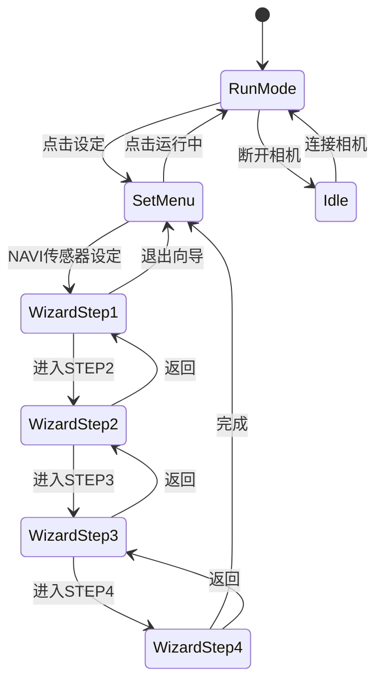
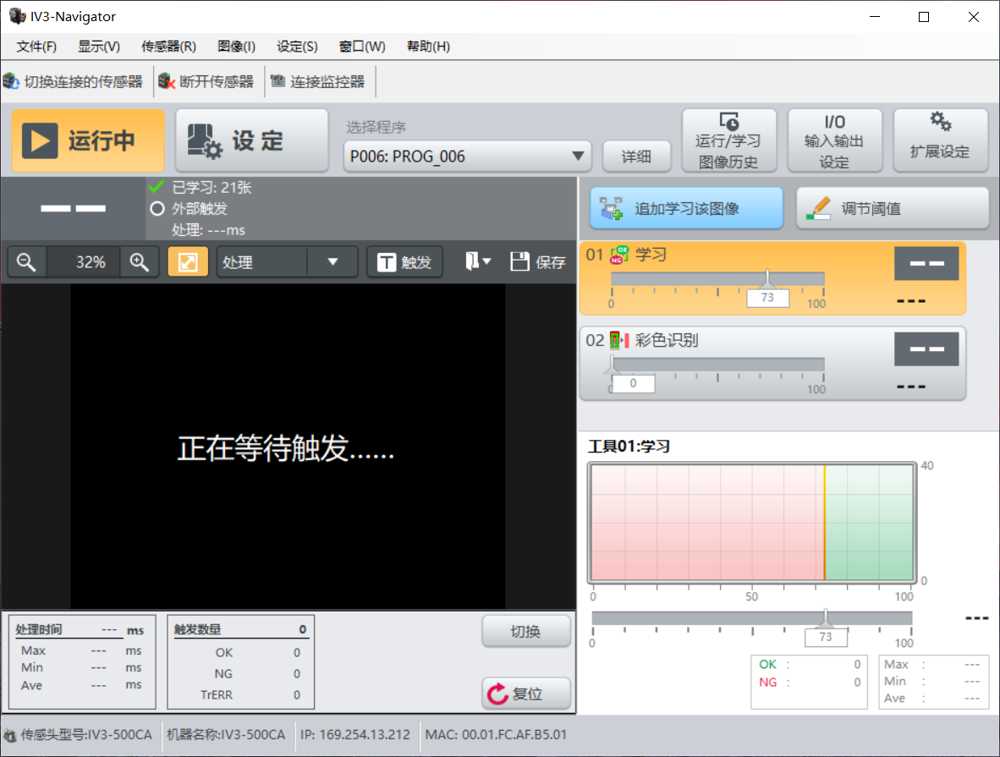
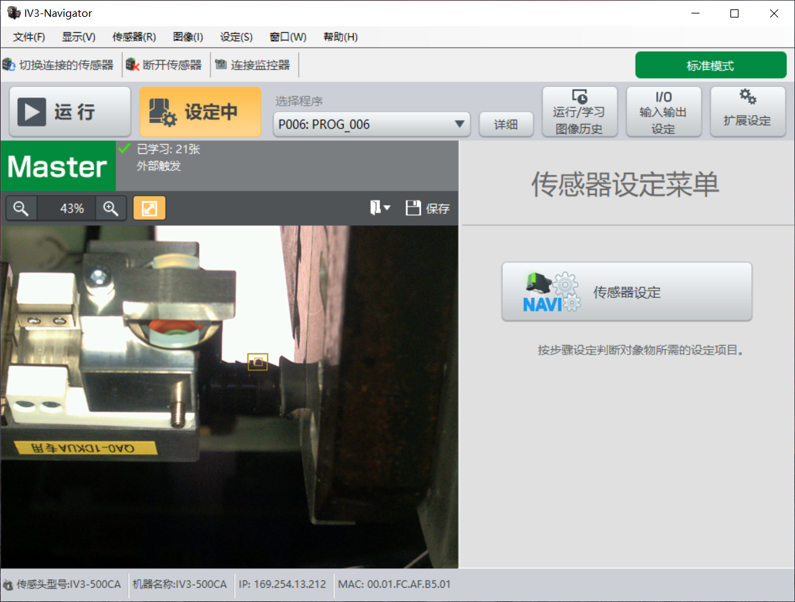
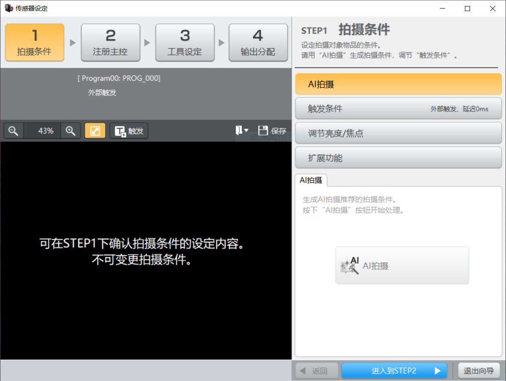
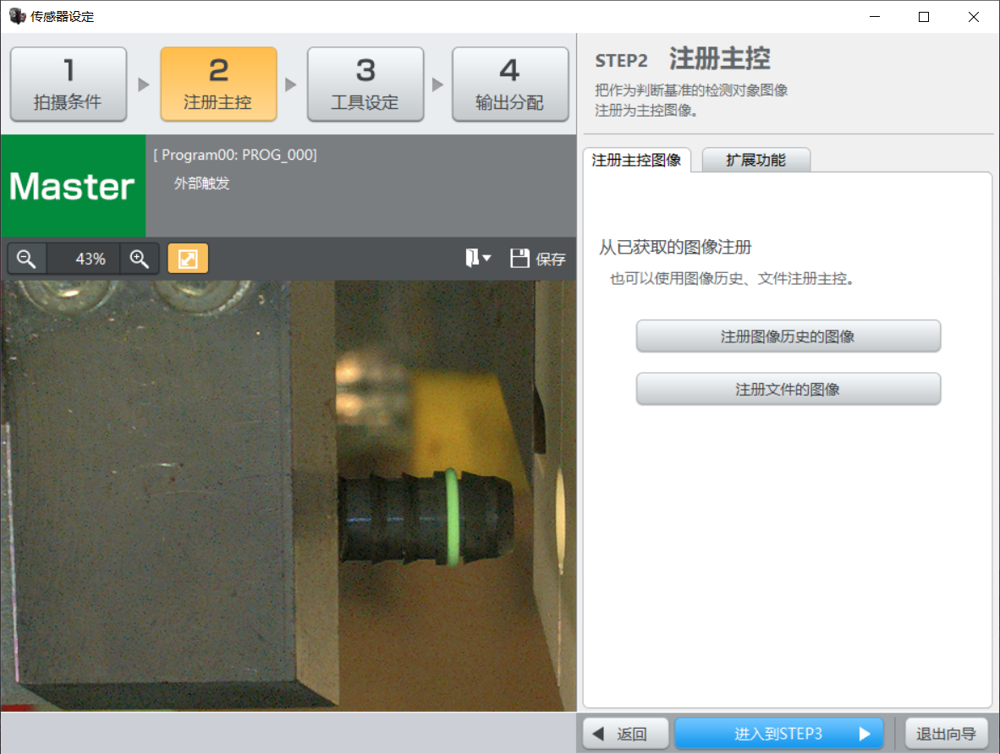
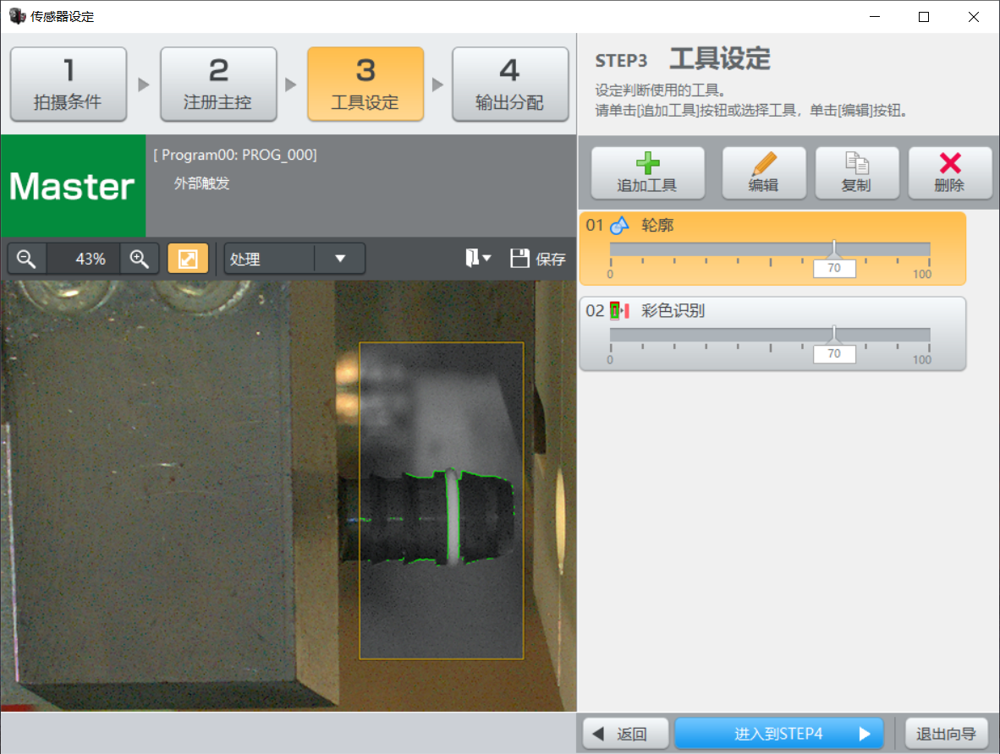
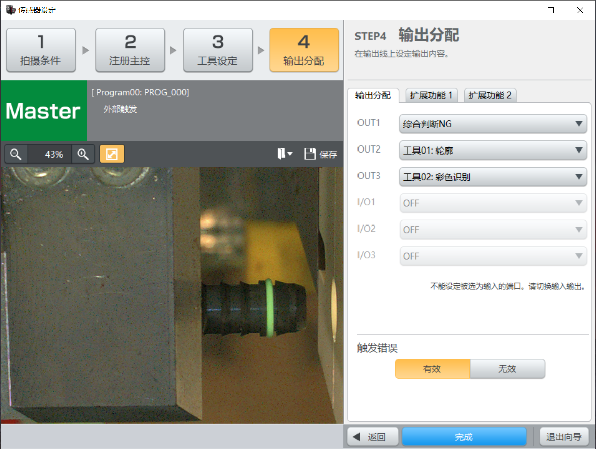
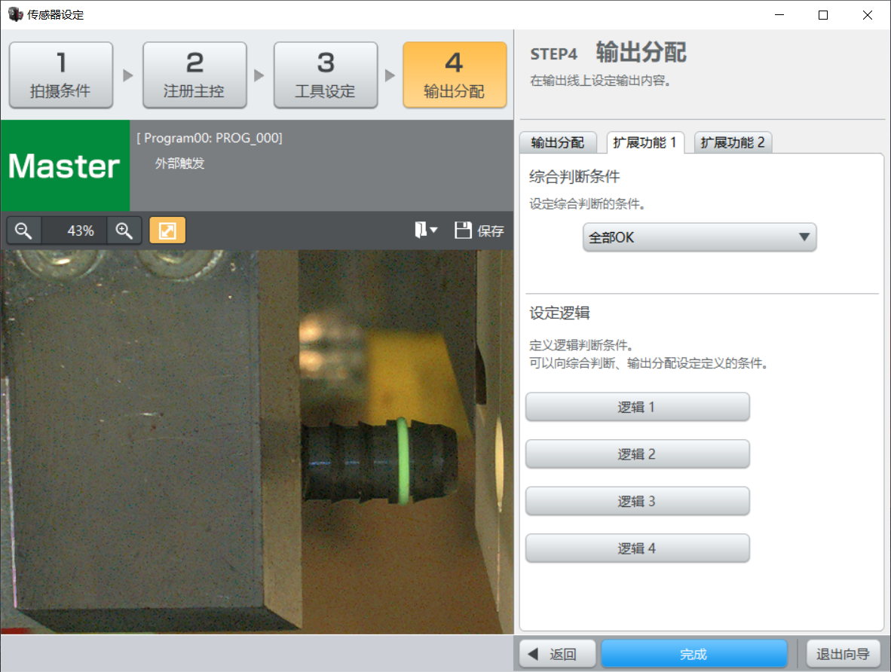
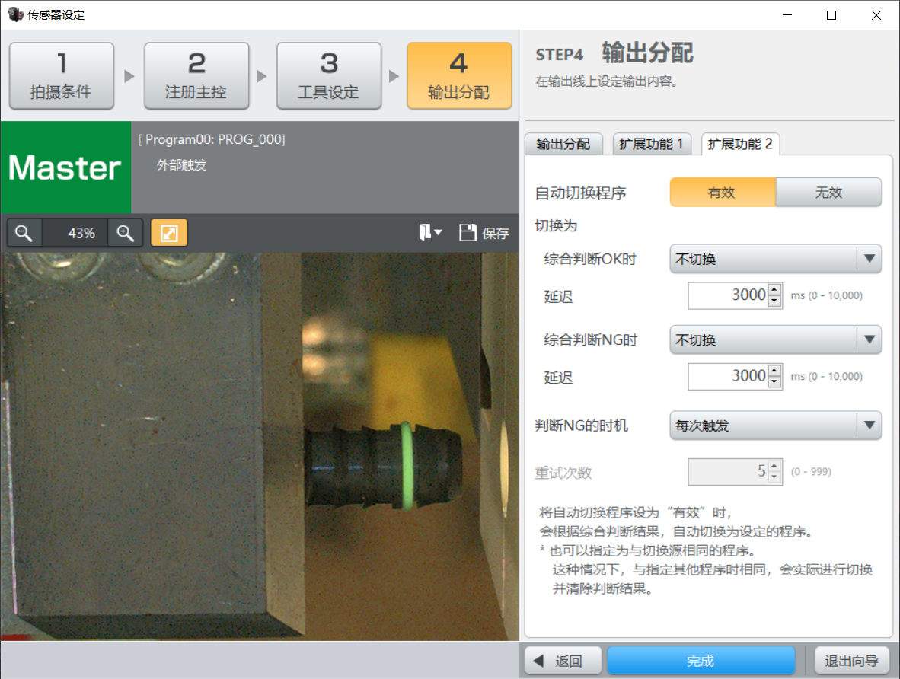
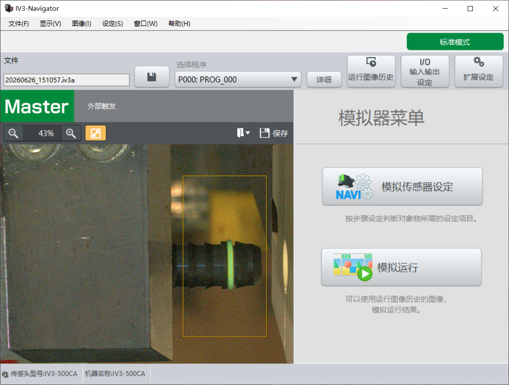

# MarkEye Web UI 设计稿

> **版本**: v1.1  
> **日期**: 2026-06-28  
> **参考界面**: `ui/ui_sample/`（run-* / set-* 系列截图，对标 Keyence IV3-Navigator）  
> **历史参考**: `ui/IV3/main_win.bmp`（见 §16 附录）  
> **显示框架**: Web 端（浏览器 / WebView 嵌入）  
> **前端模版**: 原生 HTML + JS + CSS（无框架依赖）

### 参考截图清单

| 文件 | 模式 | 说明 |
|------|------|------|
| `run-1.PNG` | RUN | 运行中：等待触发，Tool 列表与详情 |
| `run-2.PNG` | RUN | 运行中：Tool 详情展开（直方图） |
| `set-0.PNG` | SET | 设定模式首页：传感器设定菜单 |
| `set-1.PNG` | SET | 向导 STEP1：拍摄条件 |
| `set-2.PNG` | SET | 向导 STEP2：注册主控 |
| `set-3.PNG` | SET | 向导 STEP3：工具设定 |
| `set-4.PNG` | SET | 向导 STEP4：输出分配（OUT/I/O 映射） |
| `set-4-2.PNG` | SET | 向导 STEP4：综合判断条件 |
| `set-4-3.PNG` | SET | 向导 STEP4：自动切换程序 |
| `target.PNG` | — | 模拟器菜单（Phase 3 / 暂不实现） |

---

## 1. 设计目标

将 Keyence IV3-Navigator 工业视觉软件的界面层次迁移为 MarkEye 的 Web 操作界面，保留产线操作员熟悉的视觉习惯，同时对接 MarkEye 后端检测能力（颜色 / 大小 / 位置判定）。

| 目标 | 说明 |
|------|------|
| 产线可读性 | Tool 行 OK/NG、触发统计高对比色块，3 米外可辨识 |
| 实时性 | 相机帧 ≥ 15 fps 刷新，处理耗时实时显示 |
| 配置驱动 | 检测阈值来自 `config/config.yaml`，UI 只展示与调节 |
| 可维护 | 模版与资源分离，`template/` 放页面逻辑，`icon/` 放图标 |
| 模式清晰 | **运行模式**与**设定模式**（菜单页 + 四步向导）结构分离 |

---

## 2. 界面层次结构

以下为 MarkEye Web UI 的完整界面树。`run-*` 对应运行模式，`set-*` 对应设定模式。

```text
MarkEye (IV3-Navigator 对标)
|
|--- GLOBAL_SHELL                         # 所有模式共用
|       |--- TitleBar                    # 窗口标题
|       |--- MenuBar                     # 文件 / 显示 / 传感器 / 图像 / 设定 / 窗口 / 帮助
|       |--- QuickToolbar                # 切换传感器 / 断开 / 连接监控器
|       |--- ModeBar                     # [运行中] [设定]
|       |--- ProgramBar                  # 选择程序 + 详细 + 图像历史 + I/O设定 + 扩展设定
|
|--- RUN_MODE                             # run-1.PNG, run-2.PNG
|       |--- StatusHeader                # 已学习 N 张 / 外部触发 / 处理 N ms
|       |--- ImageWorkspace
|       |       |--- ImageToolbar        # 缩放 / 处理▼ / 触发 / 保存
|       |       |--- ImageViewport       # 实时帧 + 检测叠加
|       |       |--- RunFooter           # 处理时间表 + 触发数量表 + 切换/复位
|       |--- ToolPanel
|       |       |--- ToolActions         # 追加学习该图像 / 调节阈值
|       |       |--- ToolList            # Tool01 学习 / Tool02 彩色识别 …
|       |       |--- ToolDetail          # 直方图 + 阈值滑块 + OK/NG/Max/Min/Ave
|       |--- DeviceStatusBar             # 传感器型号 / IP / MAC
|
|--- SET_MODE
|       |--- PAGE_SetMenu                 # set-0.PNG — 设定模式首页
|       |       |--- ImageWorkspace      # 左：与 RUN 相同的预览区
|       |       |--- SensorSetMenu       # 右：「传感器设定菜单」+ NAVI 入口按钮
|       |
|       |--- WIZARD_SensorSetup           # set-1 ~ set-4-3 — 传感器设定向导
|               |--- StepNavBar           # STEP1~4 步骤条
|               |--- PreviewPane          # 左：Live/Master 预览 + 工具栏
|               |--- StepContent          # 右：当前步骤内容
|               |--- WizardFooter         # 返回 / 进入下一步 or 完成 / 退出向导
|               |
|               |--- STEP1_Shooting       # set-1.PNG
|               |       |--- AI拍摄
|               |       |--- 触发条件
|               |       |--- 调节亮度/焦点
|               |       |--- 扩展功能
|               |
|               |--- STEP2_Master         # set-2.PNG
|               |       |--- 注册主控图像
|               |       |--- 扩展功能
|               |
|               |--- STEP3_Tools          # set-3.PNG
|               |       |--- 工具操作栏 (追加/编辑/复制/删除)
|               |       |--- ToolList + 阈值滑块
|               |
|               |--- STEP4_Output         # set-4.PNG / set-4-2.PNG / set-4-3.PNG
|                       |--- Tab_输出分配       # OUT1~3 / I/O1~3 / 触发错误
|                       |--- Tab_综合判断       # 综合判断条件 + 逻辑1~4
|                       |--- Tab_自动切换程序   # OK/NG 时切换规则 + 延迟
|                       |--- Tab_扩展功能1
|                       |--- Tab_扩展功能2
|
|--- DeviceStatusBar                      # SET 模式底部同样显示设备信息
```

### 2.1 截图索引表

| 节点 ID | 参考文件 | MarkEye 映射 |
|---------|----------|--------------|
| `GLOBAL_SHELL` | run-1, set-0 | 全局顶栏，所有视图共用 |
| `RUN_MODE` | run-1, run-2 | `data-mode="run"` 激活时的主工作区 |
| `RUN_MODE.StatusHeader` | run-1 | `calibration.sample_count`, `trigger.source`, `frame.process_ms` |
| `RUN_MODE.ImageWorkspace` | run-1, run-2 | `#region-image` |
| `RUN_MODE.ToolPanel` | run-1, run-2 | `#region-tools` |
| `RUN_MODE.RunFooter` | run-1 | `#region-run-footer`：耗时表 + 触发统计 |
| `SET_MODE.PAGE_SetMenu` | set-0 | `#view-set-menu` |
| `SET_MODE.WIZARD_SensorSetup` | set-1 ~ set-4-3 | `#view-wizard` |
| `STEP1_Shooting` | set-1 | 拍摄条件 → `config` 触发/曝光段 |
| `STEP2_Master` | set-2 | 注册主控 → `calibration` 参考图 |
| `STEP3_Tools` | set-3 | 工具设定 → `inspect.*` 检查项 |
| `STEP4_Output` | set-4, set-4-2, set-4-3 | 输出分配 → 综合判定逻辑 / IO 映射 |
| `DeviceStatusBar` | run-1, set-0 | `#region-device-status` |

---

## 3. 参考布局分析

参考图分辨率：**1920 × 991 px**，纵横比约 **16:9**（产线触摸屏常用分辨率）。

### 3.1 全局壳层（GLOBAL_SHELL）

所有模式共用的顶栏，自顶向下四层：

```
┌──────────────────────────────────────────────────────────────────────────────┐
│ 文件(F) | 显示(V) | 传感器(R) | 图像(I) | 设定(S) | 窗口(W) | 帮助(H)          │  h≈24
├──────────────────────────────────────────────────────────────────────────────┤
│ [切换传感器] [断开传感器] [连接监控器]                                            │  h≈28
├──────────────────────────────────────────────────────────────────────────────┤
│ [▶ 运行中] [⚙ 设定]   选择程序: P006: PROG_006 ▼  [详细][图像历史][I/O][扩展]  │  h≈52
└──────────────────────────────────────────────────────────────────────────────┘
```

| 区域 | 规格 | 说明 |
|------|------|------|
| MenuBar | 高 24px，背景 `#D1D1D1` | 7 项菜单；传感器快捷键为 **R**（与旧 IV3 截图一致） |
| QuickToolbar | 高 28px | 三项图标按钮：切换传感器 / 断开 / 连接监控器 |
| ModeBar | Tab 各宽 ~160px，高 48px | 运行中激活 `#FF9900`；设定中激活 `#FFC000` |
| ProgramBar | 程序下拉 + 4 功能按钮 | 详细 / 运行·学习图像历史 / I/O 输入输出设定 / 扩展设定（Phase 2 弹窗） |

### 3.2 RUN MODE 布局

主区分栏比例：**左 62% / 右 38%**（`run-1.PNG`）。

```
┌────────────────────────────────────────────┬─────────────────────────────────┐
│ 已学习:21张  外部触发  处理:---ms            │  [追加学习该图像] [调节阈值]      │
├────────────────────────────────────────────┤                                 │
│ [🔍-] 32% [🔍+] [适应] [处理▼] [T触发] [保存]│  Tool 01  学习    ████░ 73      │
│ ┌──────────────────────────────────────┐  │  Tool 02  彩色识别 ████░  0      │
│ │     正在等待触发…… / 实时图像叠加      │  │  ─────────────────────────────  │
│ │                                      │  │  [直方图] 阈值滑块 73            │
│ └──────────────────────────────────────┘  │  OK:0 NG:0  Max/Min/Ave          │
├────────────────────────────────────────────┤                                 │
│ 处理时间 Max/Min/Ave  │  触发数量 0/OK/NG  │                                 │
│ [切换] [复位↺]                              │                                 │
├────────────────────────────────────────────┴─────────────────────────────────┤
│ 传感器型号: IV3-500CA  机器名称: IV3-500CA  IP: …  MAC: …                      │
└──────────────────────────────────────────────────────────────────────────────┘
```

要点：

- **无独立 80×80 大 OK 方块**；综合判定体现在 Tool 行 verdict、触发统计表（OK/NG/TrERR）
- StatusHeader 位于图像区**上方**深色条内，非全局顶栏
- RunFooter 含双表：处理时间（Max/Min/Ave）+ 触发数量（合计/OK/NG/TrERR）
- `run-2.PNG` 与 `run-1` 布局相同，选中 Tool 时展开直方图详情区

#### IV3 Tool → MarkEye 映射（运行模式）

| IV3 Tool | MarkEye 检查项 | config 字段 |
|----------|----------------|-------------|
| 01 学习 | 标定 / 轮廓匹配 | `calibration`, contour |
| 02 彩色识别 | 颜色检查 | `inspect.color`, `colors.*` |
| （STEP3 可扩展） | 大小 / 位置 | `size_tolerance`, `position_tolerance` |

#### IV3 → MarkEye 功能映射

| IV3 区域 | IV3 含义 | MarkEye 对应 |
|----------|----------|--------------|
| 运行中 / 设定 | 模式切换 | **运行模式** / **设定模式** |
| 程序选择下拉 | 检测程序 | **配置方案**（`config.yaml` / `config.local.yaml`） |
| 已学习 N 张 | 学习样本数 | **标定样本数**（`calibration.sample_count`） |
| 外部触发 | 触发方式 | **触发源**：外部 IO / 软触发 / 连续采集 |
| 处理 N ms | 单帧耗时 | **Pipeline 耗时**（预处理+检测+检查） |
| 追加学习该图像 | 追加训练 | **追加标定**（POST `/api/calibration/add`） |
| 调节阈值 | 阈值调节 | 展开 Tool 详情直方图 / 滑块 |
| Tool 01~02 | 检测工具 | **检查项**：学习 / 颜色（运行时可扩展大小、位置） |
| 图像区绿框 | 检测叠加 | **轮廓 + 标签**（Canvas/SVG） |
| 直方图 + 统计 | 工具详情 | 单项指标分布 |
| 触发数量表 | 批次统计 | OK/NG/TrERR 计数 |
| 复位 | 计数复位 | POST `/api/stats/reset` |

### 3.3 SET MODE 布局

设定模式分两类页面：

**A. 设定首页（PAGE_SetMenu，`set-0.PNG`）**

- 左：与 RUN 相同的 ImageWorkspace（Master 状态、已学习计数、预览图）
- 右：「传感器设定菜单」大标题 + **NAVI 传感器设定** 入口按钮
- 点击 NAVI → 进入四步向导

**B. 传感器设定向导（WIZARD_SensorSetup，`set-1` ~ `set-4-3`）**

```
┌──────────────────────────────────────────────────────────────────────────────┐
│ [1 拍摄条件] → [2 注册主控] → [3 工具设定] → [4 输出分配]   ← StepNavBar      │
├────────────────────────────────────────────┬─────────────────────────────────┤
│ Master / Live  [Program] 外部触发           │  STEP N 标题 + 说明              │
│ [🔍] 43% [🔍] [处理▼] [保存]               │  手风琴 / Tab / 表单控件          │
│ ┌──────────────────────────────────────┐  │                                 │
│ │         预览图 / 等待触发               │  │                                 │
│ └──────────────────────────────────────┘  │                                 │
├────────────────────────────────────────────┴─────────────────────────────────┤
│ [返回]              [进入到STEP N+1 / 完成]              [退出向导]              │
└──────────────────────────────────────────────────────────────────────────────┘
```

| 步骤 | 截图 | 右栏主要内容 |
|------|------|--------------|
| STEP1 拍摄条件 | set-1 | AI拍摄 / 触发条件 / 调节亮度·焦点 / 扩展功能 |
| STEP2 注册主控 | set-2 | 注册主控图像 / 扩展功能；从图像历史或文件注册 |
| STEP3 工具设定 | set-3 | 追加·编辑·复制·删除工具；Tool 列表 + 阈值滑块 |
| STEP4 输出分配 | set-4 | Tab 输出分配：OUT1~3、I/O1~3、触发错误 |
| STEP4 综合判断 | set-4-2 | 综合判断条件下拉 + 逻辑1~4 按钮 |
| STEP4 自动切换 | set-4-3 | 自动切换程序、OK/NG 切换规则、延迟、重试次数 |

向导期间 ProgramBar 中「图像历史 / I/O / 扩展设定」可隐藏或禁用，仅保留程序名只读显示。

### 3.4 暂不实现

| 素材 | 说明 |
|------|------|
| `target.PNG` | 模拟器菜单（模拟传感器设定 / 模拟运行），MarkEye Phase 3 或不做 |
| ProgramBar 弹窗 | 图像历史、I/O 设定、扩展设定无独立截图，仅保留入口，Phase 2 实现 |

---

## 4. 技术架构

```
┌─────────────┐     WebSocket / REST      ┌─────────────────────┐
│  浏览器 UI   │ ◄──────────────────────► │  Python 后端服务     │
│ template/   │   JSON + Base64 图像帧    │  src/main.py 扩展    │
│ icon/       │                           │  OpenCV 检测管线      │
└─────────────┘                           └─────────────────────┘
```

| 层级 | 技术选型 | 说明 |
|------|----------|------|
| 表现层 | HTML5 + CSS3 + ES6+ | 模版放 `template/`，无 React/Vue 依赖 |
| 图像渲染 | `<canvas>` + SVG 叠加层 | 底图 JPEG/Base64，标注用 SVG 矢量 |
| 图表 | Chart.js（可选 CDN） | Tool 详情区直方图 / 趋势图 |
| 通信 | WebSocket（实时帧）+ REST（配置/控制） | 后续 `src/web_server.py` 实现 |
| 嵌入 | Chromium WebView / 全屏浏览器 | Ubuntu 产线 kiosk 模式 |

---

## 5. 目录结构

```
markeye/
├── template/                    # Web UI 模版（JS + CSS）
│   ├── index.html               # 主窗口入口
│   ├── css/
│   │   ├── variables.css        # 设计令牌（颜色、字号、间距）
│   │   ├── layout.css           # 栅格与区域布局
│   │   ├── components.css       # 按钮、卡片、工具条、状态块
│   │   └── theme-industrial.css # 工业灰主题（默认）
│   └── js/
│       ├── app.js               # 入口：初始化、模式切换、全局事件
│       ├── layout.js            # 区域尺寸、全屏适配
│       ├── image-viewer.js      # 图像缩放、适应、叠加绘制
│       ├── tool-panel.js        # RUN 模式：Tool 列表与详情
│       ├── status-bar.js        # StatusHeader / RunFooter / DeviceStatusBar
│       ├── set-menu.js          # SET 模式首页：传感器设定菜单
│       ├── wizard.js            # SET 向导：四步导航与表单
│       ├── api-client.js        # WebSocket / REST 封装
│       └── config-editor.js     # 向导内 config 字段编辑
├── icon/                        # 图标与静态资源
│   ├── logo/
│   ├── mode/                    # 运行中 / 设定 Tab
│   ├── toolbar/                 # 缩放、处理、触发、保存
│   ├── status/
│   ├── action/                  # 追加学习、调节阈值、复位、切换
│   └── nav/
├── ui/
│   ├── ui_sample/               # 参考截图（run-* / set-*）
│   └── IV3/
│       └── main_win.bmp         # 历史布局参考
└── plan/
    └── UI设计稿.md              # 本文档
```

---

## 6. 设计令牌（Design Tokens）

定义于 `template/css/variables.css`。

### 6.1 色彩

| 令牌 | 色值 | 用途 |
|------|------|------|
| `--color-bg-app` | `#C8C8C8` | 应用背景（浅灰） |
| `--color-bg-panel` | `#E8E8E8` | 面板背景 |
| `--color-bg-dark` | `#4A4A4A` | StatusHeader / 图像工具栏背景 |
| `--color-bg-image` | `#2A2A2A` | 图像视口背景 |
| `--color-ok` | `#00B050` | OK 判定、合格 Tool |
| `--color-ng` | `#E74C3C` | NG 判定、不合格 Tool |
| `--color-run-active` | `#FF9900` | 「运行中」激活 Tab |
| `--color-set-active` | `#FFC000` | 「设定中」激活 Tab |
| `--color-settings` | `#9E9E9E` | 「设定」Tab 未激活 |
| `--color-btn-primary` | `#70B5E8` | 主操作按钮（追加学习、向导下一步） |
| `--color-btn-secondary` | `#BDBDBD` | 次操作按钮 |
| `--color-text-on-dark` | `#FFFFFF` | 深色背景文字 |
| `--color-text-primary` | `#212121` | 主文字 |
| `--color-text-secondary` | `#616161` | 辅助文字 |
| `--color-tool-selected` | `#FFF3E0` | 选中 Tool 卡片背景 |
| `--color-wizard-step-active` | `#FF9900` | 向导当前步骤高亮 |
| `--color-overlay-green` | `rgba(0,176,80,0.85)` | 检测框描边 |

### 6.2 字号

| 令牌 | 大小 | 用途 |
|------|------|------|
| `--font-family` | `"Segoe UI", "Microsoft YaHei", sans-serif` | 全局字体 |
| `--font-size-menu` | `13px` | 顶部菜单栏 |
| `--font-size-body` | `14px` | 正文、Tool 标签 |
| `--font-size-status` | `16px` | StatusHeader 文字 |
| `--font-size-metric` | `28px` | Tool 详情当前值 |
| `--font-size-wizard-title` | `20px` | 向导步骤标题 |

### 6.3 间距与圆角

| 令牌 | 值 | 用途 |
|------|-----|------|
| `--radius-sm` | `2px` | 按钮、输入框 |
| `--radius-md` | `4px` | 卡片、图像区 |
| `--spacing-xs` | `4px` | 紧凑间距 |
| `--spacing-sm` | `8px` | 组件内边距 |
| `--spacing-md` | `16px` | 区域间距 |
| `--header-height` | `104px` | 菜单 + QuickToolbar + ModeBar + ProgramBar |
| `--footer-height` | `28px` | DeviceStatusBar |
| `--sidebar-width` | `38%` | 右侧 Tool / 设定面板（min 360px, max 520px） |
| `--run-footer-height` | `72px` | RunFooter 双表区域 |

---

## 7. 主窗口布局规格

基准画布：**1920 × 991 px**（`min-width: 1280px` 时启用横向滚动或等比缩放）。

### 7.1 区域划分（CSS Grid）

```css
/* template/css/layout.css 核心结构 */
.app-root {
  display: grid;
  grid-template-rows: var(--header-height) 1fr var(--footer-height);
  grid-template-columns: 1fr;
  height: 100vh;
  overflow: hidden;
}

.main-body {
  display: grid;
  grid-template-columns: 1fr var(--sidebar-width);
  min-height: 0;
}

.main-body.is-wizard {
  grid-template-columns: 1fr 1fr; /* 向导：左右各 50% */
}
```

| 区域 ID | 可见模式 | 尺寸参考 | 内容 |
|---------|----------|----------|------|
| `#region-menu` | 全局 | 全宽 × 24px | 菜单栏 |
| `#region-quick-toolbar` | 全局 | 全宽 × 28px | 传感器快捷操作 |
| `#region-mode` | 全局 | 全宽 × 48px | 运行/设定 Tab |
| `#region-program-bar` | 全局 / 向导时部分隐藏 | 全宽 × 52px | 程序选择 + 4 功能按钮 |
| `#region-image` | RUN / SET 首页 / 向导左栏 | ~62% 宽 | 预览 + 工具栏 |
| `#region-tools` | RUN | ~38% 宽 | ToolPanel |
| `#view-set-menu` | SET 首页 | ~38% 宽 | 传感器设定菜单 |
| `#view-wizard` | SET 向导 | 全宽替换 main-body | 步骤条 + 右栏配置 |
| `#region-run-footer` | RUN | 图像区底部 | 耗时表 + 触发统计 + 切换/复位 |
| `#region-device-status` | 全局 | 全宽 × 28px | 传感器型号 / IP / MAC |

### 7.2 顶部菜单栏 `#region-menu`

| 菜单项 | 快捷键 | MarkEye 功能 |
|--------|--------|--------------|
| 文件(F) | Alt+F | 打开图片、导出结果、退出 |
| 显示(V) | Alt+V | 显示/隐藏叠加层、调试图层 |
| 传感器(R) | Alt+R | 相机选择、曝光/增益 |
| 图像(I) | Alt+I | 截图、保存当前帧 |
| 设定(S) | Alt+S | 切换设定模式 |
| 窗口(W) | Alt+W | 全屏、置顶 |
| 帮助(H) | Alt+H | 版本信息、操作说明 |

### 7.3 快捷工具栏 `#region-quick-toolbar`

| 按钮 | 功能 |
|------|------|
| 切换连接的传感器 | POST `/api/camera/switch` |
| 断开传感器 | 停止采集，WebSocket 断开 |
| 连接监控器 | 多机监控（Phase 2） |

### 7.4 模式与程序栏 `#region-mode` + `#region-program-bar`

```
┌──────────────────┬──────────────────┐     ┌─────────────────────────┐
│  ▶  运行中        │  ⚙  设定          │     │ 选择程序: P006 ▼         │
│  (橙色激活)       │  (黄橙激活)        │     │ [详细][图像历史][I/O][扩展]│
└──────────────────┴──────────────────┘     └─────────────────────────┘
```

- ModeBar：两个 Tab，宽各 160px，高 48px，图标来自 `icon/mode/`
- ProgramBar：`<select id="config-profile">` 列出 `config/*.yaml`；右侧 4 个功能按钮

**交互**：

- 点击「设定」→ 显示 `#view-set-menu`，隐藏 `#region-tools` 与 `#region-run-footer`
- 点击「运行中」→ 恢复 RUN 布局
- NAVI 按钮 → 显示 `#view-wizard`，隐藏 `#view-set-menu`

### 7.5 RUN 模式：StatusHeader `#region-status-header`

位于 `#region-image` 顶部深色条内（非全局顶栏）。

| 组件 | ID | 数据绑定 |
|------|-----|----------|
| 学习计数 | `#learn-count` | `calibration.sample_count` → 「已学习: N张」 |
| 触发方式 | `#trigger-mode` | `trigger.source` → 「外部触发」等 |
| 处理耗时 | `#process-time` | `frame.process_ms` → 「处理: Nms」 |

### 7.6 图像显示区 `#region-image`

#### 工具栏 `#image-toolbar`（高 36px）

| 按钮 | 图标 | 功能 |
|------|------|------|
| 放大 / 缩小 | `icon/toolbar/zoom-*.svg` | 缩放 ±10% |
| 缩放比 | `#zoom-label` | 显示如 `32%` |
| 适应屏幕 | `icon/toolbar/fit-screen.svg` | `scale = min(cw/iw, ch/ih)` |
| 处理 | `icon/toolbar/process.svg` | 下拉：原图 / 二值化 / 叠加 |
| 触发 | — | 软触发单帧（`Space`） |
| 保存 | — | 保存当前帧 |

#### 视口 `#image-viewport`

```html
<div id="image-viewport" class="image-viewport">
  <canvas id="frame-canvas"></canvas>
  <svg id="overlay-svg" class="overlay-layer"></svg>
  <div id="viewport-placeholder">正在等待触发……</div>
</div>
```

| 属性 | 值 |
|------|-----|
| 背景 | `#2A2A2A` |
| 叠加层 | SVG 检测框 + 标签 |
| 合格框色 | `#00B050`，线宽 2px |
| 不合格框色 | `#E74C3C`，线宽 2px |

### 7.7 RUN 模式：Tool 侧栏 `#region-tools`

#### 操作按钮 `#tool-actions`

| 按钮 | ID | 功能 |
|------|-----|------|
| 追加学习该图像 | `#btn-learn-add` | POST `/api/calibration/add` |
| 调节阈值 | `#btn-threshold` | 聚焦当前 Tool 详情滑块 |

#### Tool 列表（参考 `run-1.PNG`）

| Tool | IV3 名称 | MarkEye 类型 | 主指标 |
|------|----------|--------------|--------|
| 01 | 学习 | `learn` / contour | 匹配度 0–100 |
| 02 | 彩色识别 | `color_check` | HSV 匹配度 |
| 03+ | （STEP3 配置） | `size_check` / `position_check` | 面积 / 偏移 |

#### Tool 卡片结构

```html
<article class="tool-card" data-tool="learn" data-state="ok">
  <header class="tool-card__header">
    <span class="tool-card__id">01</span>
    <span class="tool-card__name">学习</span>
    <span class="tool-card__value">73</span>
  </header>
  <div class="tool-card__bar">
    <input type="range" min="0" max="100" value="73" />
  </div>
</article>
```

#### Tool 详情 `#tool-detail`（`run-2.PNG` 展开态）

| 区块 | 内容 |
|------|------|
| 直方图 | `<canvas id="metric-chart">` 红/绿分区 + 阈值线 |
| 阈值滑块 | 0–100，与 Tool 卡片联动 |
| 统计表 | OK / NG / Max / Min / Ave |

### 7.8 RUN 模式：底栏 `#region-run-footer`

| 区块 | 字段 | 数据源 |
|------|------|--------|
| 处理时间表 | 处理时间 / Max / Min / Ave | `frame.process_ms`, `stats.process_ms_*` |
| 触发数量表 | 合计 / OK / NG / TrERR | `stats.trigger_*` |
| 操作按钮 | 切换 / 复位 | `#btn-switch`, `#btn-reset` |

### 7.9 SET 模式：设定首页 `#view-set-menu`

| 组件 | 说明 |
|------|------|
| `.set-menu__title` | 「传感器设定菜单」 |
| `#btn-navi-wizard` | NAVI 传感器设定入口，点击进入向导 |
| `.set-menu__hint` | 「按步骤设定判断对象物所需的设定项目。」 |

### 7.10 SET 模式：向导 `#view-wizard`

| 子区域 ID | 说明 |
|-----------|------|
| `#wizard-step-nav` | 四步步骤条，当前步 `--color-wizard-step-active` |
| `#wizard-preview` | 左栏：复用 `#region-image` 结构，Live/Master 徽章 |
| `#wizard-content` | 右栏：手风琴 / Tab / 表单，随步骤切换 |
| `#wizard-footer` | 返回 / 下一步或完成 / 退出向导 |

#### STEP4 Tab 结构

| Tab | 截图 | 主要控件 |
|-----|------|----------|
| 输出分配 | set-4 | OUT1~3 下拉、I/O1~3、触发错误 有效/无效 |
| 综合判断 | set-4-2 | 综合判断条件下拉、逻辑1~4 |
| 自动切换程序 | set-4-3 | 有效/无效、OK/NG 切换规则、延迟、重试 |
| 扩展功能 1 / 2 | — | Phase 2 占位 |

### 7.11 设备状态栏 `#region-device-status`

| 字段 | 示例 |
|------|------|
| 传感器型号 | IV3-500CA |
| 机器名称 | IV3-500CA |
| IP | 169.254.13.212 |
| MAC | 00.01.FC.AF.B5.01 |

MarkEye 部署时替换为实际相机/服务信息；开发环境可显示 Mock 值。

---

## 8. 页面状态机



| 状态 | DOM 显示规则 |
|------|--------------|
| `RunMode` | 显示 `#region-tools`、`#region-run-footer`；隐藏 `#view-set-menu`、`#view-wizard` |
| `SetMenu` | 显示 `#view-set-menu`；隐藏 Tool 侧栏与 RunFooter |
| `WizardStepN` | 显示 `#view-wizard`；`#wizard-step-nav` 高亮第 N 步；ProgramBar 部分按钮隐藏 |
| `Idle` | 图像区占位「正在等待触发……」，统计值为 `---` |

---

## 9. 数据接口约定

前后端 JSON 契约（供 `api-client.js` 与后续 Python Web 服务实现）。

### 9.1 WebSocket 推送 `ws://host:port/ws/frame`

```json
{
  "type": "frame",
  "timestamp": "2026-06-28T10:30:00.123Z",
  "overall": { "passed": true },
  "frame": {
    "image_base64": "/9j/4AAQ...",
    "width": 1920,
    "height": 1080,
    "process_ms": 439
  },
  "marks": [
    {
      "label": "mark_1",
      "bbox": [120, 80, 64, 32],
      "center": [152, 96],
      "area": 1842,
      "passed": true,
      "contour": [[120,80],[184,80],[184,112],[120,112]]
    }
  ],
  "inspections": [
    {
      "tool": "learn",
      "name": "学习",
      "passed": true,
      "value": 73,
      "threshold": 73,
      "fail_reasons": []
    },
    {
      "tool": "color",
      "name": "彩色识别",
      "passed": true,
      "value": 0,
      "threshold": 0,
      "fail_reasons": []
    }
  ],
  "stats": {
    "trigger_total": 0,
    "ok_count": 0,
    "ng_count": 0,
    "trerr_count": 0,
    "process_ms_max": null,
    "process_ms_min": null,
    "process_ms_ave": null
  },
  "calibration": { "sample_count": 21 },
  "trigger": { "source": "external" }
}
```

### 9.2 REST 端点

| 方法 | 路径 | 说明 |
|------|------|------|
| GET | `/api/config` | 获取当前配置 |
| PUT | `/api/config` | 保存配置 |
| GET | `/api/config/list` | 配置方案列表 |
| GET | `/api/wizard/step/{n}` | 获取向导第 N 步配置片段 |
| PUT | `/api/wizard/step/{n}` | 保存向导第 N 步 |
| POST | `/api/calibration/add` | 追加标定样本 |
| POST | `/api/calibration/master` | 注册主控图像（STEP2） |
| POST | `/api/stats/reset` | 复位统计 |
| POST | `/api/camera/switch` | 切换相机 |
| POST | `/api/trigger` | 软触发单帧 |
| GET | `/api/health` | 健康检查 |
| GET | `/api/device` | 设备信息（型号、IP、MAC） |

---

## 10. 模版文件骨架

### 10.1 `template/index.html`

```html
<!DOCTYPE html>
<html lang="zh-CN">
<head>
  <meta charset="UTF-8" />
  <meta name="viewport" content="width=device-width, initial-scale=1" />
  <title>MarkEye — 标记视觉检测</title>
  <link rel="icon" href="../icon/logo/markeye.svg" />
  <link rel="stylesheet" href="css/variables.css" />
  <link rel="stylesheet" href="css/layout.css" />
  <link rel="stylesheet" href="css/components.css" />
  <link rel="stylesheet" href="css/theme-industrial.css" />
</head>
<body>
  <div id="app" class="app-root">
    <header id="region-header">...</header>
    <main id="region-main" class="main-body">...</main>
    <footer id="region-device-status">...</footer>
  </div>
  <script type="module" src="js/app.js"></script>
</body>
</html>
```

### 10.2 `template/js/` 模块职责

| 模块 | 职责 |
|------|------|
| `app.js` | 启动、模式切换、视图路由（RUN / SetMenu / Wizard） |
| `api-client.js` | WebSocket 连接、断线重连、消息分发 |
| `image-viewer.js` | Canvas 绘制、缩放平移、SVG 叠加 |
| `tool-panel.js` | RUN 模式 Tool 卡片、直方图、阈值滑块 |
| `status-bar.js` | StatusHeader、RunFooter、DeviceStatusBar |
| `set-menu.js` | SET 首页、NAVI 入口 |
| `wizard.js` | 四步向导导航、步骤表单、保存 |
| `layout.js` | `resize` 监听、全屏、1280 以下缩放策略 |

---

## 11. 图标资源清单

所有图标建议 **SVG**（单色 `currentColor`，便于 CSS 着色），尺寸基准 **24×24**，放在 `icon/` 对应子目录。

| 文件名 | 尺寸 | 说明 |
|--------|------|------|
| `logo/markeye.svg` | 32×32 | 窗口图标 |
| `mode/run-active.svg` | 24×24 | 运行中激活（橙底白字） |
| `mode/settings-active.svg` | 24×24 | 设定中激活（黄橙底） |
| `toolbar/zoom-in.svg` | 20×20 | 放大镜+ |
| `toolbar/zoom-out.svg` | 20×20 | 放大镜- |
| `toolbar/fit-screen.svg` | 20×20 | 四角箭头 |
| `status/ok-badge.svg` | 16×16 | Tool 行内 OK |
| `status/ng-badge.svg` | 16×16 | Tool 行内 NG |
| `action/learn-add.svg` | 20×20 | 追加学习 |
| `action/threshold.svg` | 20×20 | 调节阈值 |
| `action/reset.svg` | 24×24 | 红色 circular arrow |
| `wizard/navi.svg` | 48×48 | NAVI 传感器设定入口 |

图标风格：线性描边 1.5px，圆角端点，与 IV3 扁平工业风一致。

---

## 12. 交互与无障碍

| 项目 | 规范 |
|------|------|
| 触摸目标 | 最小 44×44 px（产线手套操作） |
| 焦点 | Tab 顺序：模式栏 → ProgramBar → 图像工具栏 → 侧栏/向导 → 底栏 |
| 键盘 | `Space` 软触发；`F11` 全屏；`Esc` 退出向导回到设定首页 |
| 防误触 | 复位、断开、退出向导需二次确认 |
| 离线 | WebSocket 断开显示红色横幅「连接已断开，正在重连…」 |

---

## 13. 响应式与部署

| 场景 | 策略 |
|------|------|
| 1920×1080 触摸屏 | 1:1 显示，默认目标 |
| 1280×720 | `transform: scale(0.67)` 或启用横向滚动 |
| Ubuntu kiosk | Chromium `--kiosk --app=http://localhost:8080/template/` |
| Windows 开发 | 直接打开 `template/index.html`（Mock 数据调试） |

---

## 14. 实施阶段

| 阶段 | 交付物 | 优先级 |
|------|--------|--------|
| P0 | `template/` RUN 模式静态布局 + Mock 数据 + `icon/` 基础图标 | 高 |
| P1 | `api-client.js` + Python WebSocket 推帧 | 高 |
| P2 | SET 首页 + 四步向导（`set-menu.js`, `wizard.js`） | 中 |
| P2 | ProgramBar 弹窗：图像历史、I/O 设定、扩展设定 | 中 |
| P3 | 模拟器菜单（`target.PNG`）、多画面、历史导出 | 低 |

---

## 15. 附录：参考截图

### RUN MODE



> `ui/ui_sample/run-1.PNG` — 运行中主界面


> `ui/ui_sample/run-2.PNG` — Tool 直方图展开

### SET MODE



> `ui/ui_sample/set-0.PNG` — 传感器设定菜单



> `ui/ui_sample/set-1.PNG`



> `ui/ui_sample/set-2.PNG`



> `ui/ui_sample/set-3.PNG`



> `ui/ui_sample/set-4.PNG` — OUT/I/O 映射



> `ui/ui_sample/set-4-2.PNG`



> `ui/ui_sample/set-4-3.PNG`

### 模拟器（暂不实现）



> `ui/ui_sample/target.PNG` — Phase 3 可选

### 历史参考


> `ui/IV3/main_win.bmp`（1920×991）— v1.0 单页布局参考，已被 ui_sample 取代

---

## 16. 变更记录

| 版本 | 日期 | 说明 |
|------|------|------|
| v1.0 | 2025-06-26 | 初版：基于 IV3 主窗口的 Web UI 设计稿 |
| v1.1 | 2026-06-28 | 基于 `ui/ui_sample/` 完整截图重构界面层次；新增 SET 模式首页与四步向导；修正 RUN 布局（StatusHeader、RunFooter、62/38 分栏）；移除大 OK 方块为主视觉 |
