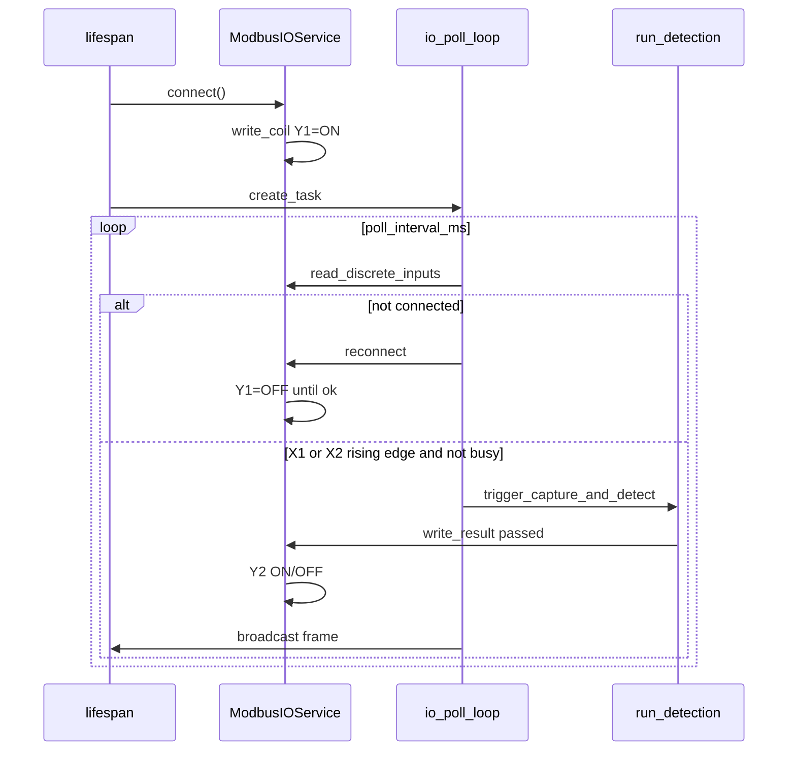
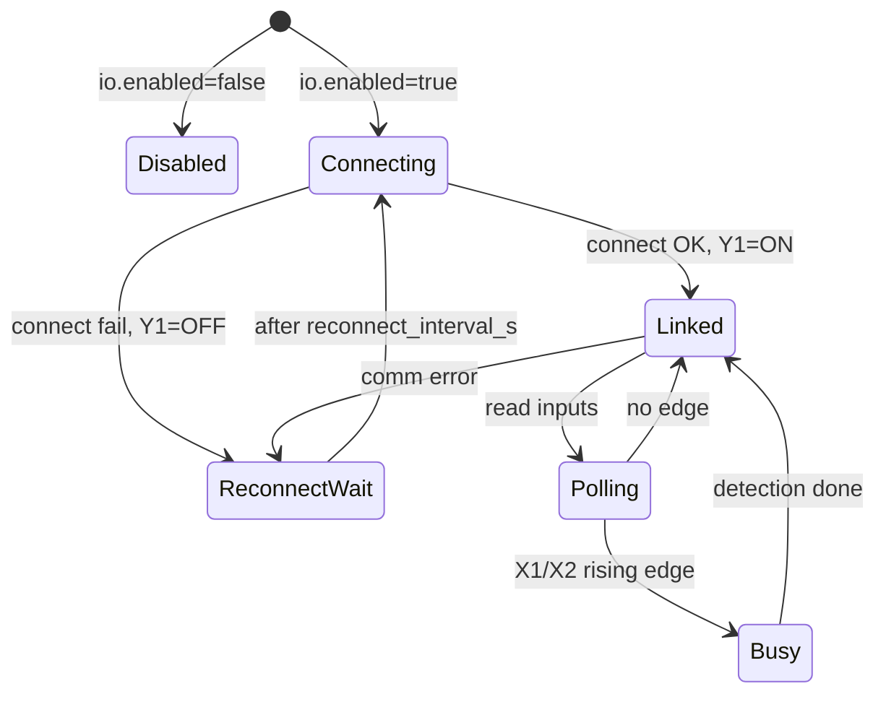

# Modbus RTU 串口 IO 开发计划

> **版本**: v1.0  
> **日期**: 2026-07-01  
> **定位**: 8 路 Modbus RTU IO 继电器与 MarkEye 产线联调专项文档  
> **关联**: [主干开发计划.md](主干开发计划.md) G4/M4 · [src/io/modbus_client.py](../src/io/modbus_client.py)

---

## 1. 背景与硬件

### 1.1 现场配置

| 项目 | 参数 |
|------|------|
| IO 模块 | 8 位 Modbus 输入/输出继电器 |
| 输入 | X1–X8（离散量输入） |
| 输出 | Y1–Y8（继电器线圈） |
| 物理接口 | RS232 |
| USB 转串口 | CH340（Windows: **COM4**） |
| 协议 | Modbus RTU |
| 波特率 | 9600 |
| 数据位/校验/停止位 | 8 / N / 1 |
| 从站地址 | **1** |

### 1.2 RS232 接线注意

- PC 端 CH340 转 RS232 线与模块 DB9 对接时确认 **TX↔RX 交叉**、**GND 共地**
- 输入 X1–X8 一般为 24V 有源输入，须按模块说明书接 COM 公共端
- 联调前断开大功率负载，先测线圈 LED/万用表

---

## 2. 通信参数与寄存器映射

### 2.1 Modbus 参数

| 参数 | 值 |
|------|-----|
| 模式 | RTU |
| Slave ID | 1 |
| 波特率 | 9600 |
| 8N1 | 默认 |

### 2.2 地址表（0-based，联调首日须用调试工具核实）

| 通道 | 类型 | 功能码 | 地址 | 说明 |
|------|------|--------|------|------|
| X1–X8 | Discrete Input | FC02 | 0–7 | 轮询读取 |
| Y1–Y8 | Coil | FC05 | 0–7 | 写单线圈 |

> 不同品牌模块可能使用 1-based 文档或偏移地址；若读写异常，用 Modbus Poll / SSCOM 对照手册调整 `io.inputs` / `io.outputs` 中的位号。

---

## 3. 控制需求映射

| # | 需求 | 软件行为 | 硬件映射 |
|---|------|----------|----------|
| ① | 启动后自动连接，循环读 X1–X8 | `lifespan` 启动 `_io_poll_loop`，周期 `read_discrete_inputs` | — |
| ② | X1 或 X2 有输入时触发检测 | **上升沿**（0→1）调用与 `POST /api/trigger` 相同流程 | `inputs.trigger_bits: [0, 1]` |
| ③ | 输出定义 | 见下表 | Y1/Y2 线圈 |

### 3.1 输出语义

| 线圈 | 含义 | ON | OFF |
|------|------|----|-----|
| **Y1** | 通信链路 | Modbus 连接正常 | 断开或通信失败 |
| **Y2** | 最近检测结果 | **NG** | **OK** |

- **TrERR**（采图失败等）：不驱动 Y2，保持上一状态
- UI 软触发 `/api/trigger` 检测完成后同样更新 Y2

### 3.2 触发策略

- **上升沿触发**：X1/X2 由 OFF→ON 时触发一次
- 信号保持 ON 期间不重复触发
- 检测进行中（`busy`）忽略新边沿

---

## 4. 库与依赖

| 库 | 用途 |
|----|------|
| **pymodbus** ≥3.6 | Modbus RTU/TCP 客户端（FC02/FC05） |
| **pyserial** ≥3.5 | 串口底层（pymodbus RTU 依赖） |

不推荐使用纯 pyserial 手写 RTU 帧（CRC、异常响应需自行维护）。

`pymodbus` 未安装时 IO 降级为日志模式，**不得导致服务启动失败**（见 CLAUDE.md）。

---

## 5. 配置说明

### 5.1 Windows 开发机（COM4）

```yaml
trigger:
  source: external          # 外部 IO 触发

io:
  enabled: true
  transport: rtu
  serial_port: COM4
  baudrate: 9600
  bytesize: 8
  parity: N
  stopbits: 1
  timeout_s: 1.0
  unit_id: 1
  poll_interval_ms: 50
  reconnect_interval_s: 3
  output_assignments:       # OUT1..OUT8，可在 STEP4 向导配置
    - link_ok               # 通信成功
    - result_ng             # 综合判断NG
    - tool:02
    - tool:01
    - off
    - off
    - off
    - off
  input_assignments:        # IN1..IN8
    - trigger
    - switch_program
    - restart
    - off
    - off
    - off
    - off
    - off
  outputs:
    link_ok: 0              # 由 output_assignments 自动同步
    result_ng: 1
  inputs:
    trigger_bits: [0]       # 由 input_assignments 自动同步
  comprehensive_logic: 1
  trerr_enabled: true
```

STEP4 向导「输出分配」Tab 编辑 `output_assignments` / `input_assignments`；「Modbus」Tab 编辑串口与连接参数。

### 5.2 Ubuntu 部署（示例）

```yaml
io:
  serial_port: /dev/ttyUSB0   # 或 /dev/ttyCH341USB0
```

### 5.3 禁用 IO（联调前 / 无硬件）

```yaml
io:
  enabled: false
```

---

## 6. 软件设计

### 6.1 模块职责

| 模块 | 职责 |
|------|------|
| `ModbusIOService` | RTU/TCP 连接、读写线圈/离散输入、Y1/Y2 输出、边沿检测 |
| `web_server._io_poll_loop` | 异步轮询、重连、触发检测、broadcast |
| `web_server.run_detection` | 检测完成后 `write_result` → Y2 |

### 6.2 时序



### 6.3 与 web_server 集成点

- `lifespan`：`connect()` + `asyncio.create_task(_io_poll_loop())`
- `run_detection()`：`io.write_result(result.passed)` / TrERR 时不写 Y2
- `reload_services()` / `reconnect_cameras()`：重建 `ModbusIOService`（轮询任务读 `state.io` 引用）

---

## 7. 状态机



---

## 8. 联调步骤

1. **硬件**：CH340 驱动正常，设备管理器显示 `USB Serial Port (COM4)`
2. **Modbus 工具**：用 Modbus Poll / 串口助手验证 FC02 读 X、FC05 写 Y
3. **配置**：`config/config.yaml` 设 `io.enabled: true`、`serial_port: COM4`
4. **启动服务**：`python -m src.web_server`，观察日志 `Modbus RTU 已连接`
5. **Y1**：模块 Y1 继电器应吸合（链路 OK）
6. **触发**：短接 X1 或 X2，应执行一次视觉检测，履历 `trigger_total` +1
7. **Y2**：OK 时 Y2 断开；NG 时 Y2 吸合
8. **断线**：拔 USB，Y1 应断开；插回后自动重连、Y1 恢复

---

## 9. 测试计划

### 9.1 单元测试（`tests/test_modbus_io.py`）

- Mock pymodbus 客户端：边沿检测、busy 屏蔽
- `write_result`：OK→Y2 OFF，NG→Y2 ON，TrERR 不写
- `set_link_ok`：Y1 线圈写入

### 9.2 实机检查表

| 项 | 预期 |
|----|------|
| 启动 Y1 | ON |
| 拔线 Y1 | OFF |
| 重连 Y1 | ON |
| X1 上升沿 | 触发 1 次 |
| X1 保持 ON | 不重复触发 |
| 检测 OK | Y2 OFF |
| 检测 NG | Y2 ON |
| `io.enabled: false` | 服务正常，无串口占用 |

---

## 10. 风险与待确认

| 风险 | 缓解 |
|------|------|
| 寄存器地址因品牌而异 | 配置化 `trigger_bits` / `link_ok` / `result_ng`；首日用调试工具定址 |
| 检测耗时 > 50ms，X1 保持 ON | 上升沿策略，不重复触发 |
| J1900 + 串口轮询 CPU | `poll_interval_ms` 可调至 50–100ms |
| pymodbus API 版本差异 | `device_id` / `slave` 参数兼容封装 |

---

## 11. 里程碑

| 阶段 | 内容 | 验收 |
|------|------|------|
| M4-IO-1 | 配置 schema + 文档 | yaml 示例可解析 |
| M4-IO-2 | RTU 读写 + Y1/Y2 | 工具可读写线圈 |
| M4-IO-3 | 轮询 + 上升沿触发 | X1 触发检测闭环 |
| M4-IO-4 | 产线实机 | §9.2 检查表全通过 |
