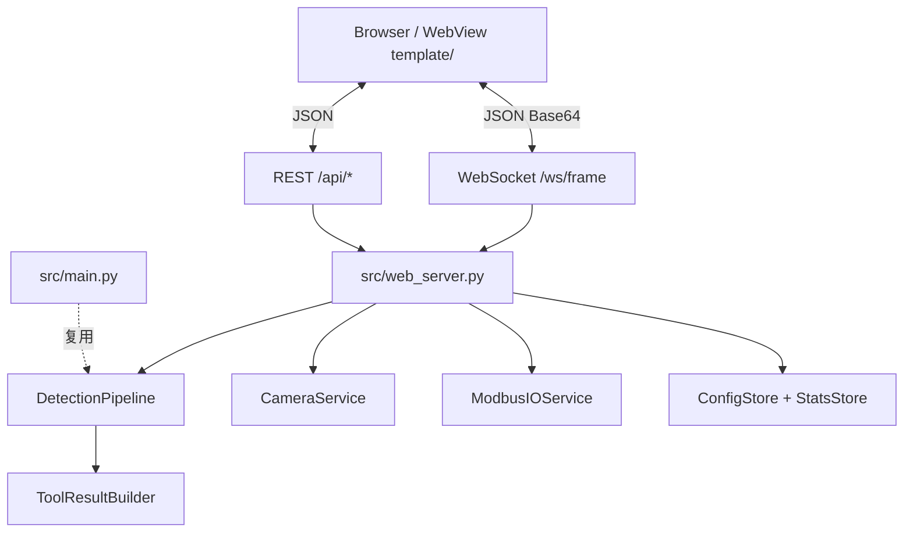

# MarkEye 主干开发计划

> **版本**: v1.0  
> **日期**: 2026-06-29  
> **定位**: [README.md](../README.md)（系统边界与 MVP）+ [UI设计稿.md](UI设计稿.md)（界面与 API）的**执行层单一事实来源**  
> **冲突决议**: 本文 §1 为准

---

## 1. 文档冲突与不一致项分析

### 1.1 需决策或需统一规范（实质性冲突）

| # | 主题 | README.md | UI设计稿.md | 代码现状 | **决议** |
|---|------|-----------|-------------|----------|----------|
| C1 | 综合结果显示 | 步骤 4：UI 显示 OK/NG、面积、HSV；NG 报警音 | v1.1 移除 80×80 大 OK 方块；Tool 行 + RunFooter 统计 | 前端已按 UI 稿实现 | **以 UI 设计稿为准**；README 已补充说明 |
| C2 | Tool 与 MVP 映射 | STEP3：颜色/面积/位置；形状匹配规划中 | Tool01=学习、Tool02=彩色识别、Tool03+=面积/位置 | Mock 2 Tool；inspector 有三项检查 | 保留 IV3 Tool 列表；`tool_builder.py` 聚合；Tool01=标定/主控 |
| C3 | 位置/面积参考基准 | 相对主控参考点 | STEP2 → calibration | inspector 用首 mark 作参考 | 扩展 `calibration.reference_center/area`；inspector 优先读主控 |
| C4 | 配置字段路径 | `preprocess.resize_width` | `inspect.color`（笔误） | config 在 `input.*`，代码读 `preprocess.*` | 统一为 `preprocess.resize_*` |
| C5 | 后端入口 | 仅 CLI `main.py` | `web_server.py` + WS/REST | 无 web_server；前端 Mock | 产线以 **web_server** 为入口；CLI 保留调参 |

### 1.2 文档遗漏（主干计划补齐）

| # | 主题 | 处理方式 |
|---|------|----------|
| G1 | NG 报警音 | WebSocket `overall.passed=false` → 前端 WebAudio / audio 播放；`output.ng_alert` |
| G2 | 图像保存策略 | `output.save_policy`: none / ok / ng / all |
| G3 | 履历持久化 | `stats_store.py` → JSON/SQLite，`output/stats.json` |
| G4 | Modbus / STEP4 | `src/io/modbus_client.py` 占位 + `io.*` 配置段 |
| G5 | 连续采集 | 设定模式预览连续流；自动运行仅触发式 |
| G6 | 实现进度 | UI P0 已完成；M1 起接真实后端 |

### 1.3 已对齐

系统边界、双模式、四步向导、OK/NG/TrERR 统计、WebSocket+REST、Ubuntu kiosk、≥15 fps 目标。

---

## 2. 项目目标与约束

- **目标**: 产线触摸屏 Web UI + Python + OpenCV 视觉检测子系统
- **硬件**: Intel J1900 / 2 GB RAM / 120 GB SATA
- **约束**: 关闭 `--debug` 开窗；推帧 JPEG quality 60–75；处理分辨率可配置
- **MVP 检测**: 颜色（HSV）、面积、位置；Modbus IO（联调定址）

---

## 3. 目标架构



### 3.1 后端模块

| 模块 | 文件 | 职责 |
|------|------|------|
| Web 服务 | `src/web_server.py` | 静态文件、WS 推帧、REST |
| 检测管线 | `src/pipeline.py` | trigger → 结果 DTO |
| Tool 聚合 | `src/tool_builder.py` | inspector → UI `inspections[]` |
| 相机 | `src/camera_service.py` | 采集、单帧触发 |
| 配置 | `src/config_store.py` | 读写 yaml、多程序 |
| 标定 | `src/calibration.py` | 主控图、sample_count |
| 统计 | `src/stats_store.py` | OK/NG/TrERR、持久化 |
| IO | `src/io/modbus_client.py` | STEP4 映射 |
| CLI | `src/main.py` | 离线调参 |

### 3.2 前端模块

| 模块 | 文件 | 状态 |
|------|------|------|
| 入口 | `template/js/app.js` | 模式路由 |
| API | `template/js/api-client.js` | 真实 WS/REST + `?mock=1` |
| RUN | tool-panel, status-bar, image-viewer | 布局完成 |
| SET | set-menu, wizard, config-editor | 向导 UI 完成 |
| Mock | mock-data.js | 开发回退 |

**API 契约**: 见 [UI设计稿.md §9](UI设计稿.md#9-数据接口约定)

### 3.3 配置 Schema

```yaml
calibration:
  master_image: null
  sample_count: 0
  reference_center: null   # [x, y]
  reference_area: null

trigger:
  source: internal         # internal | external | continuous
  exposure_ms: null

io:
  enabled: false

output:
  save_policy: none        # none | ok | ng | all
  ng_alert: true
  save_result: false
  save_dir: output/
```

---

## 4. 分阶段里程碑

| 阶段 | 名称 | 后端 | 前端 | 验收 |
|------|------|------|------|------|
| **M0** | 基线修复 | resize 路径；`pipeline.py` | — | CLI 测试通过；resize 生效 |
| **M1** | 联调主干 | `web_server` + WS + REST 最小集 | `api-client` 真实后端 | 浏览器触发 → 真实检测 |
| **M2** | RUN 产线化 | Tool 聚合；stats；TrERR | Tool03/04 动态；NG 音 | 100 次触发统计正确 |
| **M3** | SET 向导 | config CRUD；wizard step API | wizard 绑 REST | 向导保存 yaml |
| **M4** | STEP4 与 IO | modbus 占位；综合判定配置 | STEP4 Tab 绑配置 | IO 配置可读写 |
| **M5** | 产线交付 | 持久化；save_policy；kiosk 脚本 | 断线重连走查 | J1900 实机稳定 |

**与 UI 设计稿 §14 对应**

- UI P0 → **已完成**
- UI P1 → **M1**
- UI P2 → **M3–M4**
- UI P3 → **Backlog**

---

## 5. 任务清单

### 后端

- [x] M0: `pipeline.py` 从 `main.py` 抽取
- [x] M0: 修复 config resize 路径
- [x] M1: `web_server.py` 静态 + CORS + WS + REST 最小集
- [x] M2: `tool_builder.py`、`stats_store.py`、`calibration.py`
- [x] M2: `camera_service.py`
- [x] M3: 向导 step API、多程序列表
- [x] M4: `io/modbus_client.py` 占位
- [x] M5: stats 持久化、`save_policy`、部署脚本

### 前端

- [x] M1: `api-client.js` 真实 WS/REST + `?mock=1`
- [x] M2: NG 报警音；Tool 动态渲染
- [x] M3: wizard 完成调 API；程序列表加载

---

## 6. 测试与质量

- 单元: `tests/test_pipeline.py`、`tests/test_tool_builder.py`
- 集成: FastAPI TestClient → `/api/trigger`
- 性能: J1900 上 `process_ms` P95 < 500ms（可调 `preprocess.resize_width`）

---

## 7. 风险与依赖

| 风险 | 缓解 |
|------|------|
| 2 GB OOM | 预览/检测分分辨率；JPEG 60–75 |
| Tool 语义重叠 | M2 前冻结 C2 映射表 |
| Modbus 未定址 | M4 前 Mock IO |
| 文档漂移 | 变更写本文变更记录 |

---

## 8. 文档维护规则

| 文档 | 内容 |
|------|------|
| README | 边界、场景、快速开始、硬件 |
| UI设计稿 | 布局、交互、API JSON |
| 主干开发计划 | 阶段、模块、冲突决议、schema |

---

## 9. 变更记录

| 版本 | 日期 | 说明 |
|------|------|------|
| v1.0 | 2026-06-29 | 初版：冲突分析 + M0–M5 里程碑 + 模块划分 |
