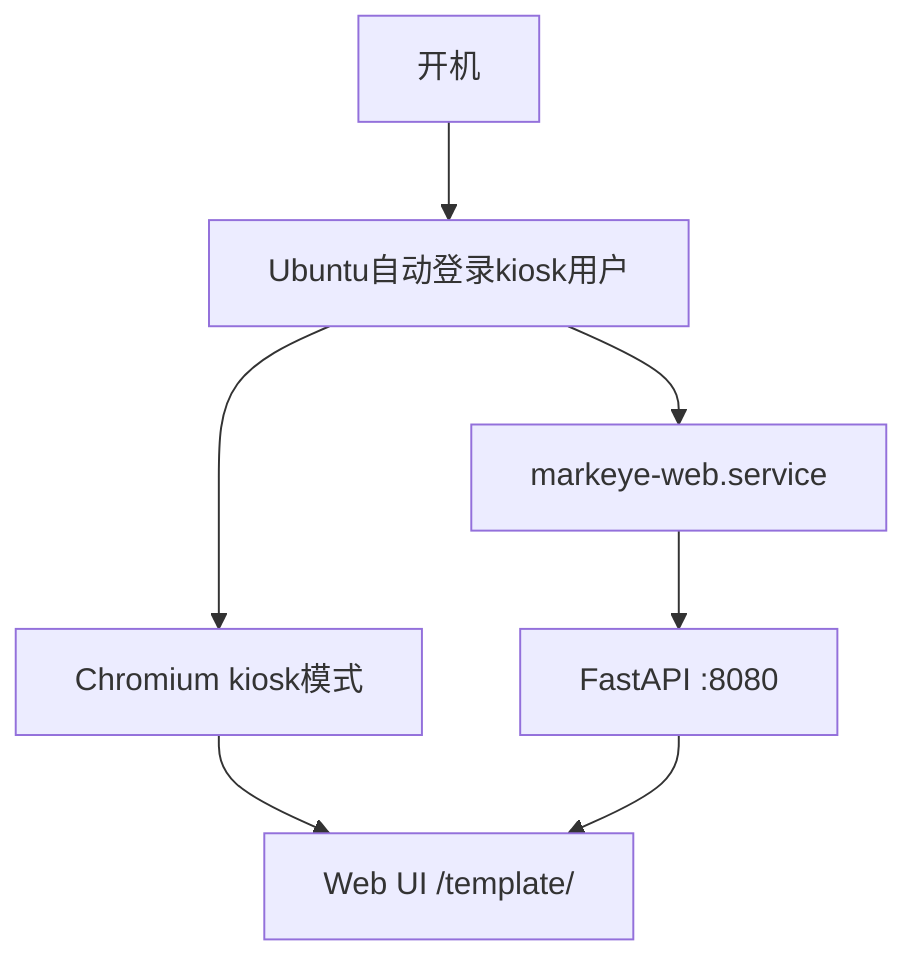
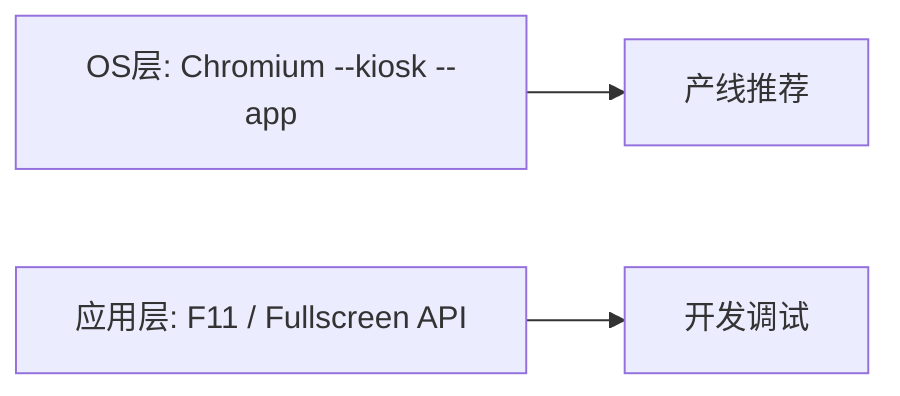

# MarkEye 产线开机自启与全屏方案

> **版本**: v1.0  
> **日期**: 2026-07-09  
> **定位**: Ubuntu 24.04 专用产线机开机自启、Chromium 全屏与运维说明  
> **相关**: [README.md](../README.md) · [deploy/install-kiosk.sh](../deploy/install-kiosk.sh)

---

## 现状

项目已具备产线 kiosk 部署脚本：

- 后端入口：[`python -m src.web_server`](../src/web_server.py)（固定端口 **8080**）
- 产线脚本：[`deploy/kiosk.sh`](../deploy/kiosk.sh) — 阶段 1 验证用一体启动（后端 + 浏览器）
- 生产安装：[`deploy/install-kiosk.sh`](../deploy/install-kiosk.sh) — 方案 B 一键安装
- 应用内全屏：[`template/js/layout.js`](../template/js/layout.js) 提供 F11 / Fullscreen API（开发用，产线不必依赖）
- **无账号密码登录**；打开 `http://127.0.0.1:8080/template/` 即进入 RUN 界面



---

## 方案对比

| 方案 | 复杂度 | 服务守护 | 全屏效果 | 适用场景 |
|------|--------|----------|----------|----------|
| **A. 直接跑 kiosk.sh** | 最低 | 弱（脚本退出即停） | 好 | 快速验证 |
| **B. systemd + XDG Autostart（推荐）** | 中 | 强（崩溃自动重启） | 好 | 专用产线机 |
| **C. 轻量窗口管理器（openbox/xinit）** | 中高 | 强 | 最好（无桌面干扰） | 2GB 内存、纯 kiosk |
| **D. 仅 systemd 后端 + 手动开浏览器** | 低 | 后端强 | 需人工 | 调试/维护 |

---

## 方案 A：直接运行 kiosk.sh（最快验证）

**做法**：Ubuntu 自动登录后，在 `~/.profile` 或 `~/.xsessionrc` 末尾执行：

```bash
/opt/markeye/deploy/kiosk.sh
# 或开发目录: ./deploy/kiosk.sh
```

**优点**
- 零额外配置，直接用 [`deploy/kiosk.sh`](../deploy/kiosk.sh)
- 已包含：`--kiosk --app=http://127.0.0.1:8080/template/`
- 若 `markeye-web.service` 已运行，脚本会自动退化为仅启动浏览器

**缺点**
- 验证模式下后端与浏览器同进程组，脚本退出会一起停
- 无 systemd 级重启；图形会话异常时不易恢复

**适合**：首次上机验证摄像头、IO、UI 是否正常。

---

## 方案 B：systemd 后端 + XDG Autostart 浏览器（推荐）

将**服务守护**与**浏览器全屏**解耦，是专用产线机最平衡的方案。

### B1. 后端 systemd 服务

模板见 [`deploy/markeye-web.service`](../deploy/markeye-web.service)，安装后位于 `/etc/systemd/system/markeye-web.service`：

```ini
[Unit]
Description=MarkEye Web Detection Service
After=network.target

[Service]
Type=simple
User=markeye
WorkingDirectory=/opt/markeye
Environment=PATH=/opt/markeye/.venv/bin
ExecStart=/opt/markeye/.venv/bin/python -m src.web_server
Restart=on-failure
RestartSec=3

[Install]
WantedBy=multi-user.target
```

要点：
- 部署路径建议固定为 `/opt/markeye`（避免 syncfolder 路径变动）
- 开机即启，**不依赖图形界面**（相机/Modbus 可先就绪）
- 利用现有 [`POST /api/system/shutdown`](../src/web_server.py) + [`stop_app.sh`](../stop_app.sh) 做维护停机

### B2. Chromium kiosk 自启动

模板见 [`deploy/markeye-kiosk.desktop`](../deploy/markeye-kiosk.desktop)，安装到 `~/.config/autostart/markeye-kiosk.desktop`：

```ini
[Desktop Entry]
Type=Application
Name=MarkEye Kiosk
Exec=/opt/markeye/deploy/kiosk-browser.sh
Terminal=false
X-GNOME-Autostart-enabled=true
X-GNOME-Autostart-Delay=3
```

Chrome 等效命令（若安装 `google-chrome-stable`）：

```bash
google-chrome --kiosk --noerrdialogs --disable-infobars --app=http://127.0.0.1:8080/template/
```

### B3. Ubuntu 自动登录

编辑 `/etc/gdm3/custom.conf`（GNOME）或 LightDM 配置：

```ini
[daemon]
AutomaticLoginEnable=true
AutomaticLogin=markeye
```

由 [`deploy/install-kiosk.sh`](../deploy/install-kiosk.sh) 自动配置。

### B4. kiosk 加固（可选）

| 措施 | 作用 |
|------|------|
| `unclutter -idle 0` | 隐藏鼠标 |
| 禁用休眠/屏保 | `gsettings`（见 [`deploy/kiosk-harden.sh`](../deploy/kiosk-harden.sh)） |
| 禁用 Chromium 首次运行向导 | `--no-first-run` |
| 禁止 Alt+Tab / 任务栏 | GNOME 扩展或改用方案 C |

**优点**
- 后端崩溃自动重启；浏览器可独立重启
- 符合「专用产线机、仅打开 APP、全屏」需求
- 维护时：`systemctl stop markeye-web` + 关浏览器即可

**缺点**
- 需配置 3 处（systemd、autostart、autologin）
- 仍运行完整 GNOME 桌面（J1900 + 2GB 略吃资源）

---

## 方案 C：openbox + xinit 纯 kiosk（资源最省）

不启动完整 GNOME，适合 **J1900 / 2GB** 专用机。安装脚本：[`deploy/kiosk-openbox.sh`](../deploy/kiosk-openbox.sh)

**做法概要**：
1. `markeye-web.service` 同方案 B
2. kiosk 用户 `.xinitrc` 由 `kiosk-openbox.sh` 生成
3. 通过 `.bash_profile` 在 tty1 自动执行 `startx`

**优点**
- 内存占用最低；无桌面元素干扰
- 全屏最「干净」，操作员难以误触系统 UI

**缺点**
- 配置门槛更高；远程维护、Wi-Fi 设置不如桌面方便
- 需额外处理显示管理器与权限

---

## 方案 D：仅自启后端

只部署 `markeye-web.service`，浏览器由人工或远程打开。

**适合**：维护窗口、多台客户端访问同一检测机、或先用 VNC 调参再上 kiosk。

---

## 全屏实现说明（两层）



| 层级 | 方式 | 产线是否需要 |
|------|------|-------------|
| **OS 层** | `chromium --kiosk --app=URL` | **是（主方案）** |
| **应用层** | [`toggleFullscreen()`](../template/js/layout.js) / F11 | 否（kiosk 已无边框全屏） |

`--kiosk` 与 `--app` 组合效果：
- 无地址栏、无标签栏
- 单应用窗口占满屏幕
- 比应用内 F11 更稳定（不依赖用户手势/API 权限）

---

## 推荐实施路径（专用产线机）

**阶段 1 — 验证**
1. 安装 Chromium：`sudo apt install chromium-browser unclutter`
2. 运行 `./deploy/verify-kiosk.sh` 与 `./deploy/kiosk.sh`
3. 确认 URL：`http://127.0.0.1:8080/template/`（非 mock：`?mock=0` 为默认）

**阶段 2 — 生产化（推荐方案 B）**
1. 执行 `sudo ./deploy/install-kiosk.sh`（部署到 `/opt/markeye`，创建 `markeye` 用户）
2. 重启产线机：`sudo reboot`
3. 重启后应自动登录并全屏打开 MarkEye

**阶段 3 — 资源优化（若 2GB 吃紧）**
- 执行 `sudo ./deploy/kiosk-openbox.sh` 切换到 openbox + xinit
- 关闭不必要的 GNOME 服务

---

## 部署文件清单

| 文件 | 用途 |
|------|------|
| [`deploy/verify-kiosk.sh`](../deploy/verify-kiosk.sh) | 阶段 1 环境验证 |
| [`deploy/kiosk.sh`](../deploy/kiosk.sh) | 阶段 1 一体启动（验证用） |
| [`deploy/kiosk-browser.sh`](../deploy/kiosk-browser.sh) | 仅启动 Chromium 全屏 |
| [`deploy/markeye-web.service`](../deploy/markeye-web.service) | systemd 单元模板 |
| [`deploy/markeye-kiosk.desktop`](../deploy/markeye-kiosk.desktop) | XDG 自启动模板 |
| [`deploy/markeye-kiosk-harden.desktop`](../deploy/markeye-kiosk-harden.desktop) | 屏保禁用 / 双实例检测 |
| [`deploy/kiosk-harden.sh`](../deploy/kiosk-harden.sh) | kiosk 加固脚本 |
| [`deploy/install-kiosk.sh`](../deploy/install-kiosk.sh) | 方案 B 一键安装 |
| [`deploy/kiosk-openbox.sh`](../deploy/kiosk-openbox.sh) | 方案 C 轻量 kiosk |

---

## 运维与排错

| 操作 | 命令 |
|------|------|
| 查看服务状态 | `systemctl status markeye-web` |
| 查看日志 | `journalctl -u markeye-web -f` |
| 优雅停机 | `./stop_app.sh` 或 `systemctl stop markeye-web` |
| 健康检查 | `curl http://127.0.0.1:8080/api/health` |
| 冒烟测试 | [`smoke/run_smoke.sh`](../smoke/run_smoke.sh) |

注意：[`src/process_lock.py`](../src/process_lock.py) 使用 `/tmp/markeye.lock` 防止双实例；**不要同时用 kiosk.sh 与 systemd 启动两个后端**。

---

## 结论

- **专用产线机 + 仅打开 APP + 全屏**：推荐 **方案 B（systemd 后端 + Chromium autostart + Ubuntu 自动登录）**
- **验证阶段**：[`deploy/kiosk.sh`](../deploy/kiosk.sh) / [`deploy/verify-kiosk.sh`](../deploy/verify-kiosk.sh)
- **全屏**：产线用 Chromium `--kiosk --app=...`，无需改前端登录或 F11 逻辑
- **无需账号登录**：打开 URL 即进入 RUN 界面
