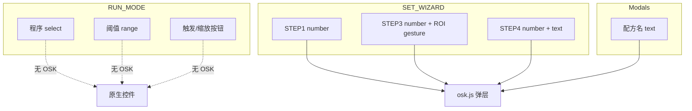

# MarkEye 触摸输入与应用内软键盘规划

> **版本**: v1.0  
> **日期**: 2026-07-17  
> **定位**: 产线触摸屏为主、兼容外接键鼠的应用内软键盘（方案 A）开发计划  
> **相关**: [UI设计稿.md](./UI设计稿.md) · [产线开机自启方案.md](./产线开机自启方案.md) · [鲁棒性测试报告.md](./鲁棒性测试报告.md)

---

## 目标与约束

- **主输入**：产线触摸屏；**兼容**：外接键鼠。
- **软键盘**：仅应用内实现（不安装 onboard / 不改 Chromium 虚拟键盘标志）。
- **v1 文本**：ASCII / 数字 / IP / 路径类短串；中文程序名通过外接键盘或 IME（应用内不做拼音面板）。
- **部署**：现有 Chromium `--kiosk` + [`deploy/kiosk-browser.sh`](../deploy/kiosk-browser.sh) 不变；`unclutter` 仅藏光标，不影响触控与软键盘。

## 输入分类总表

将现有 UI（[`template/`](../template/)）全部交互归为 6 类，决定是否弹出软键盘：

| 类别 | 典型控件 | 软键盘 | 处理策略 |
|------|----------|--------|----------|
| **N 数值** | 曝光/增益、触发延迟、ROI、HSV、面积、Modbus 端口/波特率/脉冲等 `input[type=number]` | 是 | 整数盘或小数盘（见 `data-osk`） |
| **T 文本** | 串口名、TCP host、配方名 `#prompt-input` | 是 | ASCII 全键盘（含 `.` `_` `/` `-` `:`） |
| **S 选择** | 程序/触发源/工具类型/OUT·IN 映射等 `<select>` | 否 | 原生或后续大触控下拉；本阶段保证 44px 行高 |
| **R 连续调节** | RUN 阈值、向导 HSV 预览 `input[type=range]` | 否 | 加大滑块命中区；可选旁路 ± 步进（不做软键盘） |
| **B 离散操作** | 按钮、切换组、菜单、确认框 | 否 | 触控目标 ≥ 44px；外接鼠标保持现有点击 |
| **G 手势编辑** | STEP3 ROI 拖拽/缩放、HSV 取色（[`image-viewer.js`](../template/js/image-viewer.js)） | 否 | 补 `pointer` 事件（与 OSK 同里程碑交付，否则触摸无法设定 ROI） |

**不在 v1 范围**：登录/PIN、文件选择、`textarea`、死代码 [`config-editor.js`](../template/js/config-editor.js)。

### 按界面挂载点

- **RUN**：几乎无 OSK；程序切换用 select；阈值用 range。
- **向导 STEP1–4**：绝大多数 `number` + Modbus `text` → OSK。
- **配方弹窗**：[`promptModal`](../template/js/layout.js) 的 `#prompt-input` → ASCII 盘。
- **外接键盘快捷键**（[`app.js`](../template/js/app.js) `_bindKeyboard`）：保留 `Space` / `Esc` / `F11` / `Alt+菜单`；软键盘打开时不抢占这些键的物理输入。

## 软键盘产品行为（方案 A）

### 模块

新增 [`template/js/osk.js`](../template/js/osk.js) + [`template/css/osk.css`](../template/css/osk.css)，在 [`app.js`](../template/js/app.js) 启动时 `initOsk()`；在 [`index.html`](../template/index.html) 挂一层 `#osk-root`（固定底部或贴近字段，避让当前焦点，避免遮挡「确定/下一步」）。

### 布局类型（由 `data-osk` 声明）

| `data-osk` | 用途 | 键位要点 |
|------------|------|----------|
| `int` | 相机 ID、延迟 ms、端口、单位 ID、HSV 整数等 | 0–9、←、C、±（可选）、确定 |
| `decimal` | 增益、容差、step 非整数 | 同上 + `.` |
| `ip` | `io-host` | 0–9 + `.` |
| `text` | 串口、配方名 | QWERTY + 符号页（`.` `_` `/` `-` `:`）；Shift；无中文 |

未声明时：`type=number` → 有 `step` 含小数则 `decimal` 否则 `int`；`type=text` → `text`。

### 显示 / 隐藏规则

1. **显示**：可编辑的 `input[type=number|text]` 获得焦点（`focusin`），且当前判定为「触摸优先模式」。
2. **隐藏**：失焦且焦点不在 OSK 面板内；点「确定」；按 Esc；切换 RUN/关闭弹窗/切换向导步骤时强制关闭。
3. **触摸优先 vs 键鼠**：
   - 默认产线：**触摸优先**（显示 OSK）。
   - 检测到物理键入（`keydown` 且 `e.isTrusted`，且事件非 OSK 按钮合成）或 `navigator.keyboard`/`PointerEvent.pointerType === 'mouse'` 连续使用时，进入 **键鼠模式**：隐藏 OSK，恢复系统/外接输入。
   - 再次出现 `pointerType === 'touch'` 的 focus → 切回触摸优先并弹出 OSK。
4. **禁用系统键盘抢焦点**：对挂载 OSK 的字段设 `inputmode="none"`（减少部分环境弹出系统键盘）；应用内键盘用 `mousedown/pointerdown` + `preventDefault` 保持焦点不丢。
5. **只读/disabled**：不弹出。

### 写入与校验

- 按键改 `input.value`，派发 `input` / `change`，复用向导现有监听（无需逐字段改业务逻辑）。
- 尊重 `min` / `max` / `step`：确定时钳制或提示非法（与现有 number 行为一致）。
- 配方名：沿用现有 trim / 非法字符规则。

### 字段标注工作量（实现时）

在 [`wizard.js`](../template/js/wizard.js) 模板字符串中为关键字段补 `data-osk`（其余靠默认推断即可），例如：

- `io-host` → `ip`
- `io-serial-port`、`#prompt-input` → `text`
- `gain`、容差类 → `decimal`
- 其余 number → `int`

## 触控配套（非键盘但属「输入」）

与 OSK 同迭代，否则设定链路在触摸屏上仍断：

1. **ROI / 取色**：[`image-viewer.js`](../template/js/image-viewer.js) 将 `mouse*` 改为 `pointer*`（含 `setPointerCapture`），保证单指拖拽/缩放与取色。
2. **命中区**：向导表单行、工具栏小按钮对照 [UI设计稿](./UI设计稿.md) 的 44px；避免仅依赖 `--touch-min` 而遗漏 28–32px 控件。
3. **select**：v1 保持原生；若产线 Chromium 下拉难用，二期再做全屏选项列表（不阻塞 OSK）。

## 明确不做

- 系统级软键盘安装与 kiosk 脚本改动。
- 应用内中文输入法。
- 为 range / select / 按钮做软键盘。
- 设定页 PIN / 操作员权限（与输入正交，另立需求）。

## 验证要点

- 无物理键盘：向导改曝光、HSV、ROI 数值、Modbus host/串口、新建配方名均可完成。
- 插入 USB 键盘：键入时 OSK 消失，快捷键仍可用；拔掉后触摸再 focus 恢复 OSK。
- 鼠标：可点击 OSK 或直接点输入框用物理键盘；ROI 拖拽可用鼠标与触摸。
- kiosk：`unclutter` 开启下软键盘与按钮仍可点。
- 补充鲁棒性用例：在 [鲁棒性测试报告.md](./鲁棒性测试报告.md) 扩展 T4-028 相关「软键盘数值/文本/键鼠切换」。

## 主要改动文件

| 文件 | 变更 |
|------|------|
| 新建 `template/js/osk.js` | 焦点托管、布局、键鼠模式切换 |
| 新建 `template/css/osk.css` | 底部/浮动键盘、大键帽 |
| [`template/index.html`](../template/index.html) | `#osk-root`、引入样式 |
| [`template/js/app.js`](../template/js/app.js) | `initOsk()` |
| [`template/js/wizard.js`](../template/js/wizard.js) | 关键 `data-osk` / `inputmode` |
| [`template/js/layout.js`](../template/js/layout.js) | prompt 输入参与 OSK |
| [`template/js/image-viewer.js`](../template/js/image-viewer.js) | pointer 事件 |
| [`template/css/components.css`](../template/css/components.css) | 触控命中区微调 |

## 实施顺序与待办

1. OSK 核心 + int/decimal 盘，挂全局 `focusin`。
2. text/ip 盘 + prompt 弹窗。
3. 向导字段 `data-osk` 标注与遮挡避让。
4. ROI pointer 化 + 触控命中区。
5. 键鼠自动切换与 kiosk 实机验收。

| ID | 内容 |
|----|------|
| osk-core | 实现 `template/js/osk.js` + `osk.css`：int/decimal 盘、focus 显示/隐藏、`inputmode=none` |
| osk-text-ip | 增加 text/ip 布局，接入 promptModal 与 Modbus 文本字段 |
| wizard-annotate | `wizard.js` / `index.html` 标注 `data-osk`，处理遮挡与步骤切换关闭 |
| pointer-roi | `image-viewer.js` 改为 pointer 事件；表单/工具栏触控命中区 ≥44px |
| hid-switch-verify | 键鼠/触摸模式切换逻辑 + kiosk 实机与鲁棒性用例补充 |
